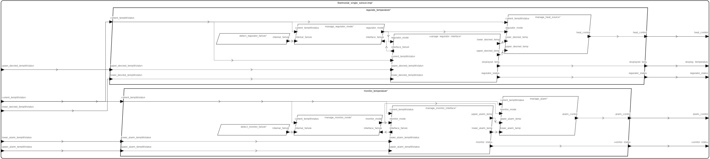

# <!---title_start-->Isolette<!---title_end-->

The data, links, and images in this file are auto-generated from HAMR's report generation facility.  Additional text explanations have been added for readability. 
<!---description_start-->
<!---description_end-->
## <!--arch-section-title_start-->AADL Architecture<!--arch-section-title_end-->
<!--arch-section-description_start-->
<!--arch-section-description_end-->
<!--arch-section-aadl-arch-diagram_start-->

<!--arch-section-aadl-arch-diagram_end-->

The following documentation blocks provide links to AADL textual representation source of the Thread components in the system.
* "Type" links to the AADL component type declaration (providing the port-based interface for the component)
* "Behavior Specification" (when present) links to the GUMBO behavior contract for the component.  HAMR automatically compiles the GUMBO contract 
   to both an code-level contract used for Logika code verification as well as an executable representation of the contract 
   (as pure boolean functions) used in unit and system testing.

<!--arch-section-aadl-arch-component-info-isolette_single_sensor_Instance_start-->
|System: [Isolette::isolette.single_sensor](aadl/aadl/packages/Isolette.aadl#L71) |
|:--|
<!--arch-section-aadl-arch-component-info-isolette_single_sensor_Instance_end-->
<!--arch-section-aadl-arch-component-info-heat_controller_start-->
|Thread: HS <!--[heat_controller](aadl/aadl/packages/Devices.aadl#L118)--> |
|:--|
|Type: [Devices::Heat_Source](aadl/aadl/packages/Devices.aadl#L124)<br>Implementation: [Devices::Heat_Source.impl](aadl/aadl/packages/Devices.aadl#L135)|
|Periodic: 1000 ms|

<!--arch-section-aadl-arch-component-info-heat_controller_end-->
<!--arch-section-aadl-arch-component-info-thermostat_start-->
|Thread: TS <!--[thermostat](aadl/aadl/packages/Devices.aadl#L73)--> |
|:--|
|Type: [Devices::Temperature_Sensor](aadl/aadl/packages/Devices.aadl#L79)<br>Implementation: [Devices::Temperature_Sensor.impl](aadl/aadl/packages/Devices.aadl#L90)|
|Periodic: 1000 ms|

<!--arch-section-aadl-arch-component-info-thermostat_end-->
<!--arch-section-aadl-arch-component-info-oit_start-->
|Thread: OpInterface <!--[oit](aadl/aadl/packages/Isolette.aadl#L274)--> |
|:--|
|Type: [Isolette::operator_interface_thread](aadl/aadl/packages/Isolette.aadl#L287)<br>Implementation: [Isolette::operator_interface_thread.impl](aadl/aadl/packages/Isolette.aadl#L307)|
|Periodic: 1000 ms|

<!--arch-section-aadl-arch-component-info-oit_end-->

The following Thread components will house the application logic for the Isolette's safety monitoring (**Monitor**) subsystem.  Each of these components has a GUMBO contract that is used in the component and system implementations for component-level SMT-based verification, unit testing, and system testing.

<!--arch-section-aadl-arch-component-info-manage_alarm_start-->
|Thread: MonMA <!--[manage_alarm](aadl/aadl/packages/Monitor.aadl#L39)--> |
|:--|
|Type: [Monitor::Manage_Alarm](aadl/aadl/packages/Monitor.aadl#L300)<br>Implementation: [Monitor::Manage_Alarm.impl](aadl/aadl/packages/Monitor.aadl#L412)<br>Behavior Specification: [GUMBO](aadl/aadl/packages/Monitor.aadl#L320)|
|Periodic: 1000 ms|

<!--arch-section-aadl-arch-component-info-manage_alarm_end-->
<!--arch-section-aadl-arch-component-info-manage_monitor_interface_start-->
|Thread: MonMMI <!--[manage_monitor_interface](aadl/aadl/packages/Monitor.aadl#L37)--> |
|:--|
|Type: [Monitor::Manage_Monitor_Interface](aadl/aadl/packages/Monitor.aadl#L96)<br>Implementation: [Monitor::Manage_Monitor_Interface.impl](aadl/aadl/packages/Monitor.aadl#L207)<br>Behavior Specification: [GUMBO](aadl/aadl/packages/Monitor.aadl#L129)|
|Periodic: 1000 ms|

<!--arch-section-aadl-arch-component-info-manage_monitor_interface_end-->
<!--arch-section-aadl-arch-component-info-manage_monitor_mode_start-->
|Thread: MonMMM <!--[manage_monitor_mode](aadl/aadl/packages/Monitor.aadl#L41)--> |
|:--|
|Type: [Monitor::Manage_Monitor_Mode](aadl/aadl/packages/Monitor.aadl#L221)<br>Implementation: [Monitor::Manage_Monitor_Mode.impl](aadl/aadl/packages/Monitor.aadl#L286)<br>Behavior Specification: [GUMBO](aadl/aadl/packages/Monitor.aadl#L239)|
|Periodic: 1000 ms|
<!--arch-section-aadl-arch-component-info-manage_monitor_mode_end-->

<!--arch-section-aadl-arch-component-info-detect_monitor_failure_start-->
|Thread: DMF <!--[detect_monitor_failure](aadl/aadl/packages/Monitor.aadl#L43)--> |
|:--|
|Type: [Monitor::Detect_Monitor_Failure](aadl/aadl/packages/Monitor.aadl#L428)<br>Implementation: [Monitor::Detect_Monitor_Failure.impl](aadl/aadl/packages/Monitor.aadl#L440)|
|Periodic: 1000 ms|
<!--arch-section-aadl-arch-component-info-detect_monitor_failure_end-->

The following Thread components will house the application logic for the Isolette's control (**Regulate**) subsystem.  Each of these components has a GUMBO contract that is used in the component and system implementations for component-level SMT-based verification, unit testing, and system testing.


<!--arch-section-aadl-arch-component-info-manage_heat_source_start-->
|Thread: RegMHS <!--[manage_heat_source](aadl/aadl/packages/Regulate.aadl#L42)--> |
|:--|
|Type: [Regulate::Manage_Heat_Source](aadl/aadl/packages/Regulate.aadl#L398)<br>Implementation: [Regulate::Manage_Heat_Source.impl](aadl/aadl/packages/Regulate.aadl#L489)<br>Behavior Specification: [GUMBO](aadl/aadl/packages/Regulate.aadl#L426)|
|Periodic: 1000 ms|

<!--arch-section-aadl-arch-component-info-manage_heat_source_end-->
<!--arch-section-aadl-arch-component-info-manage_regulator_interface_start-->
|Thread: RegMRI <!--[manage_regulator_interface](aadl/aadl/packages/Regulate.aadl#L38)--> |
|:--|
|Type: [Regulate::Manage_Regulator_Interface](aadl/aadl/packages/Regulate.aadl#L106)<br>Implementation: [Regulate::Manage_Regulator_Interface.impl](aadl/aadl/packages/Regulate.aadl#L256)<br>Behavior Specification: [GUMBO](aadl/aadl/packages/Regulate.aadl#L170)|
|Periodic: 1000 ms|

<!--arch-section-aadl-arch-component-info-manage_regulator_interface_end-->
<!--arch-section-aadl-arch-component-info-manage_regulator_mode_start-->
|Thread: RegMRM <!--[manage_regulator_mode](aadl/aadl/packages/Regulate.aadl#L46)--> |
|:--|
|Type: [Regulate::Manage_Regulator_Mode](aadl/aadl/packages/Regulate.aadl#L270)<br>Implementation: [Regulate::Manage_Regulator_Mode.impl](aadl/aadl/packages/Regulate.aadl#L383)<br>Behavior Specification: [GUMBO](aadl/aadl/packages/Regulate.aadl#L296)|
|Periodic: 1000 ms|

<!--arch-section-aadl-arch-component-info-manage_regulator_mode_end-->

<!--arch-section-aadl-arch-component-info-detect_regulator_failure_start-->
|Thread: DRF <!--[detect_regulator_failure](aadl/aadl/packages/Regulate.aadl#L48)--> |
|:--|
|Type: [Regulate::Detect_Regulator_Failure](aadl/aadl/packages/Regulate.aadl#L506)<br>Implementation: [Regulate::Detect_Regulator_Failure.impl](aadl/aadl/packages/Regulate.aadl#L518)|
|Periodic: 1000 ms|

<!--arch-section-aadl-arch-component-info-detect_regulator_failure_end-->

## <!--behavior-code-title_start-->Behavior Code<!--behavior-code-title_end-->

The following items link to the Slang source code for the application logic of each thread.  In the HAMR development workflow, skeletons for these files are automatically created, along with APIs for communicating over model-declared ports in the component type.  GUMBO component contracts in the AADL model are automatically translated to Slang/Logika contracts and included in the generated skeletons.  Then, the application developer uses a conventional development approach for coding the application logic in Slang (C workflows are also supported).  Logika can be applied to verify that the user's application code conforms to the generated Logika contracts (which are derived automatically from model-level GUMBO contracts).  The HAMR build framework will integrate the user-code application logic for each component (below) with auto-generated threading and communication infrastructure code, along with HAMR's implementation of AADL run-time (based on AADL's standardized Run-Time Services).   Note that HAMR is smart enough to accomodate changes to model-level interface declarations (ports, etc.) as well as changes to GUMBO contracts -- user code will not be clobbered when the model is changed and HAMR code generation is rerun.  Instead, HAMR uses specially designed delimiters in the application code files to, e.g., re-weave updated contracts into the application code.

Executable Slang versions of the GUMBO contracts (referred to as "GUMBOX" contracts) are also automatically generated in the code generation process.  These executable contracts are automatically integrated into the system testing process:  appropriate portions of the executable contracts are invoked in the pre-state and the post-state of a thread dispatch to dynamically check that the thread's behavior for that particular dispatch conforms to the model-level GUMBO contracts.

<!--behavior-code-description_start-->
<!--behavior-code-description_end-->

### Monitor Sub-system Behavior (Application) Code and Executable Contracts

<!--behavior-code-slang-code-manage_monitor_interface_start-->
[MonMMI](hamr/slang/src/main/component/isolette/Monitor/Manage_Monitor_Interface_impl_thermostat_monitor_temperature_manage_monitor_interface.scala)
<br>[GumboX](hamr/slang/src/main/bridge/isolette/Monitor/Manage_Monitor_Interface_impl_thermostat_monitor_temperature_manage_monitor_interface_GumboX.scala)
<!--behavior-code-slang-code-manage_monitor_interface_end-->
<!--behavior-code-slang-code-manage_alarm_start-->
[MonMA](hamr/slang/src/main/component/isolette/Monitor/Manage_Alarm_impl_thermostat_monitor_temperature_manage_alarm.scala)
<br>[GumboX](hamr/slang/src/main/bridge/isolette/Monitor/Manage_Alarm_impl_thermostat_monitor_temperature_manage_alarm_GumboX.scala)
<!--behavior-code-slang-code-manage_alarm_end-->
<!--behavior-code-slang-code-manage_monitor_mode_start-->
[MonMMM](hamr/slang/src/main/component/isolette/Monitor/Manage_Monitor_Mode_impl_thermostat_monitor_temperature_manage_monitor_mode.scala)
<br>[GumboX](hamr/slang/src/main/bridge/isolette/Monitor/Manage_Monitor_Mode_impl_thermostat_monitor_temperature_manage_monitor_mode_GumboX.scala)
<!--behavior-code-slang-code-manage_monitor_mode_end-->
<!--behavior-code-slang-code-detect_monitor_failure_start-->
[DMF](hamr/slang/src/main/component/isolette/Monitor/Detect_Monitor_Failure_impl_thermostat_monitor_temperature_detect_monitor_failure.scala)

<!--behavior-code-slang-code-detect_monitor_failure_end-->

### Regulate Sub-system Behavior (Application) Code and Executable Contracts

<!--behavior-code-slang-code-manage_regulator_interface_start-->
[RegMRI](hamr/slang/src/main/component/isolette/Regulate/Manage_Regulator_Interface_impl_thermostat_regulate_temperature_manage_regulator_interface.scala)
<br>[GumboX](hamr/slang/src/main/bridge/isolette/Regulate/Manage_Regulator_Interface_impl_thermostat_regulate_temperature_manage_regulator_interface_GumboX.scala)
<!--behavior-code-slang-code-manage_regulator_interface_end-->
<!--behavior-code-slang-code-manage_heat_source_start-->
[RegMHS](hamr/slang/src/main/component/isolette/Regulate/Manage_Heat_Source_impl_thermostat_regulate_temperature_manage_heat_source.scala)
<br>[GumboX](hamr/slang/src/main/bridge/isolette/Regulate/Manage_Heat_Source_impl_thermostat_regulate_temperature_manage_heat_source_GumboX.scala)
<!--behavior-code-slang-code-manage_heat_source_end-->
<!--behavior-code-slang-code-manage_regulator_mode_start-->
[RegMRM](hamr/slang/src/main/component/isolette/Regulate/Manage_Regulator_Mode_impl_thermostat_regulate_temperature_manage_regulator_mode.scala)
<br>[GumboX](hamr/slang/src/main/bridge/isolette/Regulate/Manage_Regulator_Mode_impl_thermostat_regulate_temperature_manage_regulator_mode_GumboX.scala)
<!--behavior-code-slang-code-manage_regulator_mode_end-->
<!--behavior-code-slang-code-detect_regulator_failure_start-->
[DRF](hamr/slang/src/main/component/isolette/Regulate/Detect_Regulator_Failure_impl_thermostat_regulate_temperature_detect_regulator_failure.scala)

<!--behavior-code-slang-code-detect_regulator_failure_end-->

### Operator Interface and Sensing/Actuation Devices 

<!--behavior-code-slang-code-oit_start-->
[OpInterface](hamr/slang/src/main/component/isolette/Isolette/operator_interface_thread_impl_operator_interface_oip_oit.scala)

<!--behavior-code-slang-code-oit_end-->
<!--behavior-code-slang-code-thermostat_start-->
[TS](hamr/slang/src/main/component/isolette/Devices/Temperature_Sensor_impl_temperature_sensor_cpi_thermostat.scala)

<!--behavior-code-slang-code-thermostat_end-->
<!--behavior-code-slang-code-heat_controller_start-->
[HS](hamr/slang/src/main/component/isolette/Devices/Heat_Source_impl_heat_source_cpi_heat_controller.scala)

<!--behavior-code-slang-code-heat_controller_end-->

## <!---title_start-->Metrics<!---title_end-->
<!---description_start-->
<!---description_end-->
### <!---title_start-->AADL Metrics<!---title_end-->
<!---description_start-->
<!---description_end-->

The following section provides statistics about the AADL model to give a rough idea of its size (in terms of number of AADL modeling elements that impact the size of the deployed system).

<!---_start-->
| | |
|:--|:--|
|Threads|11|
|Ports|49|
|Connections|27|
<!---_end-->

### <!---title_start-->JVM Metrics<!---title_end-->
<!---description_start-->
<!---description_end-->

The following section provides statistics about the Slang source code.

<!---Isolette_code_metrics_start-->
Directories Scanned Using [https://github.com/AlDanial/cloc](https://github.com/AlDanial/cloc) v1.94:
- [hamr/slang/src/main](hamr/slang/src/main)

<u><b>Total LOC</b></u>

Total number of HAMR-generated and developer-written lines of code
Language|files|blank|comment|code
:-------|-------:|-------:|-------:|-------:
Scala|144|5655|2910|25327
--------|--------|--------|--------|--------
SUM:|144|5655|2910|25327

<u><b>User LOC</b></u>

The number of lines of code written by the developer.
"Log" are lines of code used for logging that
likely would be excluded in a release build
 |Type|code |
 |:--|--:|
 |Behavior|184|
 |Log|16|
 |--------|--------|
 |SUM:|200|
<!---Isolette_code_metrics_end-->

## <!--system-testing-setup-title_start-->System Testing<!--system-testing-setup-title_end-->
<!--system-testing-setup-description_start-->
<!--system-testing-setup-description_end-->
### <!--configurations-title_start-->Test Run Configurations<!--configurations-title_end-->
<!--configurations-description_start-->
<!--configurations-description_end-->
#### <!--Regulate_Subsystem_Test_wSlangCheck_DSC_Test_Harness_configurations-title_start-->Configurations for Regulate_Subsystem_Test_wSlangCheck_DSC_Test_Harness<!--Regulate_Subsystem_Test_wSlangCheck_DSC_Test_Harness_configurations-title_end-->
<!--Regulate_Subsystem_Test_wSlangCheck_DSC_Test_Harness_configurations-description_start-->
<!--Regulate_Subsystem_Test_wSlangCheck_DSC_Test_Harness_configurations-description_end-->
<!--Regulate_Subsystem_Test_wSlangCheck_DSC_Test_Harness_configurations-Regulate_Subsystem_Test_wSlangCheck_DSC_Test_Harness_HC__Normal_____Heat_On_configuration_content_start-->
<table>
<tr><th colspan=2 align="left"><a href="hamr/slang/src/test/system/isolette/system_tests/rst/Regulate_Subsystem_Test_wSlangCheck.scala#L58">HC__Normal_____Heat_On</a></th>
</tr><tr>
<td>Description:</td><td>HC; Normal; => Heat On</td>
</tr><tr>
<td>Script Schema:</td><td><a href="hamr/slang/src/test/system/isolette/system_tests/rst/Regulate_Subsystem_Test_wSlangCheck.scala#L302">Regulator_1HP_script_schema</a></td>
</tr><tr>
<td>Property:</td><td><a href="hamr/slang/src/test/system/isolette/system_tests/rst/Regulate_Subsystem_Test_wSlangCheck.scala#L439">sysProp_NormalModeHeatOn</a></td>
</tr><tr>
<td>Randomization Profile:</td><td><a href="hamr/slang/src/test/system/isolette/system_tests/rst/Regulate_Subsystem_Test_wSlangCheck.scala#L267)">Valid Ranges Profile</a></td>
</tr><tr>
<td>Random Vector Filter:</td><td><a href="hamr/slang/src/test/system/isolette/system_tests/rst/Regulate_Subsystem_Test_wSlangCheck.scala#L642)">compute_spec_lower_is_not_higher_than_upper_assume</a></td>
</tr>
</table>

<!--Regulate_Subsystem_Test_wSlangCheck_DSC_Test_Harness_configurations-Regulate_Subsystem_Test_wSlangCheck_DSC_Test_Harness_HC__Normal_____Heat_On_configuration_content_end-->
<!--Regulate_Subsystem_Test_wSlangCheck_DSC_Test_Harness_configurations-Regulate_Subsystem_Test_wSlangCheck_DSC_Test_Harness_HC__Normal_____Heat_Off_configuration_content_start-->
<table>
<tr><th colspan=2 align="left"><a href="hamr/slang/src/test/system/isolette/system_tests/rst/Regulate_Subsystem_Test_wSlangCheck.scala#L65">HC__Normal_____Heat_Off</a></th>
</tr><tr>
<td>Description:</td><td>HC; Normal; => Heat Off</td>
</tr><tr>
<td>Script Schema:</td><td><a href="hamr/slang/src/test/system/isolette/system_tests/rst/Regulate_Subsystem_Test_wSlangCheck.scala#L302">Regulator_1HP_script_schema</a></td>
</tr><tr>
<td>Property:</td><td><a href="hamr/slang/src/test/system/isolette/system_tests/rst/Regulate_Subsystem_Test_wSlangCheck.scala#L455">sysProp_NormalModeHeatOff</a></td>
</tr><tr>
<td>Randomization Profile:</td><td><a href="hamr/slang/src/test/system/isolette/system_tests/rst/Regulate_Subsystem_Test_wSlangCheck.scala#L267)">Valid Ranges Profile</a></td>
</tr><tr>
<td>Random Vector Filter:</td><td><a href="hamr/slang/src/test/system/isolette/system_tests/rst/Regulate_Subsystem_Test_wSlangCheck.scala#L642)">compute_spec_lower_is_not_higher_than_upper_assume</a></td>
</tr>
</table>

<!--Regulate_Subsystem_Test_wSlangCheck_DSC_Test_Harness_configurations-Regulate_Subsystem_Test_wSlangCheck_DSC_Test_Harness_HC__Normal_____Heat_Off_configuration_content_end-->
<!--Regulate_Subsystem_Test_wSlangCheck_DSC_Test_Harness_configurations-Regulate_Subsystem_Test_wSlangCheck_DSC_Test_Harness_HC__Failing__CT____Heat_Off_configuration_content_start-->
<table>
<tr><th colspan=2 align="left"><a href="hamr/slang/src/test/system/isolette/system_tests/rst/Regulate_Subsystem_Test_wSlangCheck.scala#L75">HC__Failing__CT____Heat_Off</a></th>
</tr><tr>
<td>Description:</td><td>HC; Failing; CT => Heat Off</td>
</tr><tr>
<td>Script Schema:</td><td><a href="hamr/slang/src/test/system/isolette/system_tests/rst/Regulate_Subsystem_Test_wSlangCheck.scala#L302">Regulator_1HP_script_schema</a></td>
</tr><tr>
<td>Property:</td><td><a href="hamr/slang/src/test/system/isolette/system_tests/rst/Regulate_Subsystem_Test_wSlangCheck.scala#L472">sysProp_InvalidCTNormalModeHeatOff</a></td>
</tr><tr>
<td>Randomization Profile:</td><td><a href="hamr/slang/src/test/system/isolette/system_tests/rst/Regulate_Subsystem_Test_wSlangCheck.scala#L267)">Valid Ranges Profile</a></td>
</tr><tr>
<td>Random Vector Filter:</td><td><a href="hamr/slang/src/test/system/isolette/system_tests/rst/Regulate_Subsystem_Test_wSlangCheck.scala#L642)">compute_spec_lower_is_not_higher_than_upper_assume</a></td>
</tr>
</table>

<!--Regulate_Subsystem_Test_wSlangCheck_DSC_Test_Harness_configurations-Regulate_Subsystem_Test_wSlangCheck_DSC_Test_Harness_HC__Failing__CT____Heat_Off_configuration_content_end-->
<!--Regulate_Subsystem_Test_wSlangCheck_DSC_Test_Harness_configurations-Regulate_Subsystem_Test_wSlangCheck_DSC_Test_Harness_HC__Failing__UDT____Heat_Off_configuration_content_start-->
<table>
<tr><th colspan=2 align="left"><a href="hamr/slang/src/test/system/isolette/system_tests/rst/Regulate_Subsystem_Test_wSlangCheck.scala#L83">HC__Failing__UDT____Heat_Off</a></th>
</tr><tr>
<td>Description:</td><td>HC; Failing; UDT => Heat Off</td>
</tr><tr>
<td>Script Schema:</td><td><a href="hamr/slang/src/test/system/isolette/system_tests/rst/Regulate_Subsystem_Test_wSlangCheck.scala#L302">Regulator_1HP_script_schema</a></td>
</tr><tr>
<td>Property:</td><td><a href="hamr/slang/src/test/system/isolette/system_tests/rst/Regulate_Subsystem_Test_wSlangCheck.scala#L482">sysProp_InvalidUDTNormalModeHeatOff</a></td>
</tr><tr>
<td>Randomization Profile:</td><td><a href="hamr/slang/src/test/system/isolette/system_tests/rst/Regulate_Subsystem_Test_wSlangCheck.scala#L267)">Valid Ranges Profile</a></td>
</tr><tr>
<td>Random Vector Filter:</td><td><a href="hamr/slang/src/test/system/isolette/system_tests/rst/Regulate_Subsystem_Test_wSlangCheck.scala#L642)">compute_spec_lower_is_not_higher_than_upper_assume</a></td>
</tr>
</table>

<!--Regulate_Subsystem_Test_wSlangCheck_DSC_Test_Harness_configurations-Regulate_Subsystem_Test_wSlangCheck_DSC_Test_Harness_HC__Failing__UDT____Heat_Off_configuration_content_end-->
<!--Regulate_Subsystem_Test_wSlangCheck_DSC_Test_Harness_configurations-Regulate_Subsystem_Test_wSlangCheck_DSC_Test_Harness_HC__Failing__LDT____Heat_Off_configuration_content_start-->
<table>
<tr><th colspan=2 align="left"><a href="hamr/slang/src/test/system/isolette/system_tests/rst/Regulate_Subsystem_Test_wSlangCheck.scala#L91">HC__Failing__LDT____Heat_Off</a></th>
</tr><tr>
<td>Description:</td><td>HC; Failing; LDT => Heat Off</td>
</tr><tr>
<td>Script Schema:</td><td><a href="hamr/slang/src/test/system/isolette/system_tests/rst/Regulate_Subsystem_Test_wSlangCheck.scala#L302">Regulator_1HP_script_schema</a></td>
</tr><tr>
<td>Property:</td><td><a href="hamr/slang/src/test/system/isolette/system_tests/rst/Regulate_Subsystem_Test_wSlangCheck.scala#L492">sysProp_InvalidLDTNormalModeHeatOff</a></td>
</tr><tr>
<td>Randomization Profile:</td><td><a href="hamr/slang/src/test/system/isolette/system_tests/rst/Regulate_Subsystem_Test_wSlangCheck.scala#L267)">Valid Ranges Profile</a></td>
</tr><tr>
<td>Random Vector Filter:</td><td><a href="hamr/slang/src/test/system/isolette/system_tests/rst/Regulate_Subsystem_Test_wSlangCheck.scala#L642)">compute_spec_lower_is_not_higher_than_upper_assume</a></td>
</tr>
</table>

<!--Regulate_Subsystem_Test_wSlangCheck_DSC_Test_Harness_configurations-Regulate_Subsystem_Test_wSlangCheck_DSC_Test_Harness_HC__Failing__LDT____Heat_Off_configuration_content_end-->
<!--Regulate_Subsystem_Test_wSlangCheck_DSC_Test_Harness_configurations-Regulate_Subsystem_Test_wSlangCheck_DSC_Test_Harness_HC__Failing__Internal_Failure____Heat_Off_configuration_content_start-->
<table>
<tr><th colspan=2 align="left"><a href="hamr/slang/src/test/system/isolette/system_tests/rst/Regulate_Subsystem_Test_wSlangCheck.scala#L99">HC__Failing__Internal_Failure____Heat_Off</a></th>
</tr><tr>
<td>Description:</td><td>HC; Failing; Internal Failure => Heat Off</td>
</tr><tr>
<td>Script Schema:</td><td><a href="hamr/slang/src/test/system/isolette/system_tests/rst/Regulate_Subsystem_Test_wSlangCheck.scala#L302">Regulator_1HP_script_schema</a></td>
</tr><tr>
<td>Property:</td><td><a href="hamr/slang/src/test/system/isolette/system_tests/rst/Regulate_Subsystem_Test_wSlangCheck.scala#L503">sysProp_InternalFailureNormalModeHeatOff</a></td>
</tr><tr>
<td>Randomization Profile:</td><td><a href="hamr/slang/src/test/system/isolette/system_tests/rst/Regulate_Subsystem_Test_wSlangCheck.scala#L267)">Valid Ranges Profile</a></td>
</tr><tr>
<td>Random Vector Filter:</td><td><a href="hamr/slang/src/test/system/isolette/system_tests/rst/Regulate_Subsystem_Test_wSlangCheck.scala#L642)">compute_spec_lower_is_not_higher_than_upper_assume</a></td>
</tr>
</table>

<!--Regulate_Subsystem_Test_wSlangCheck_DSC_Test_Harness_configurations-Regulate_Subsystem_Test_wSlangCheck_DSC_Test_Harness_HC__Failing__Internal_Failure____Heat_Off_configuration_content_end-->
<!--Regulate_Subsystem_Test_wSlangCheck_DSC_Test_Harness_configurations-Regulate_Subsystem_Test_wSlangCheck_DSC_Test_Harness_HC__Failing__Error_Condition____Heat_Off_configuration_content_start-->
<table>
<tr><th colspan=2 align="left"><a href="hamr/slang/src/test/system/isolette/system_tests/rst/Regulate_Subsystem_Test_wSlangCheck.scala#L108">HC__Failing__Error_Condition____Heat_Off</a></th>
</tr><tr>
<td>Description:</td><td>HC; Failing; Error Condition => Heat Off</td>
</tr><tr>
<td>Script Schema:</td><td><a href="hamr/slang/src/test/system/isolette/system_tests/rst/Regulate_Subsystem_Test_wSlangCheck.scala#L302">Regulator_1HP_script_schema</a></td>
</tr><tr>
<td>Property:</td><td><a href="hamr/slang/src/test/system/isolette/system_tests/rst/Regulate_Subsystem_Test_wSlangCheck.scala#L513">sysProp_ErrorConditionHeatOff</a></td>
</tr><tr>
<td>Randomization Profile:</td><td><a href="hamr/slang/src/test/system/isolette/system_tests/rst/Regulate_Subsystem_Test_wSlangCheck.scala#L267)">Valid Ranges Profile</a></td>
</tr><tr>
<td>Random Vector Filter:</td><td><a href="hamr/slang/src/test/system/isolette/system_tests/rst/Regulate_Subsystem_Test_wSlangCheck.scala#L642)">compute_spec_lower_is_not_higher_than_upper_assume</a></td>
</tr>
</table>

<!--Regulate_Subsystem_Test_wSlangCheck_DSC_Test_Harness_configurations-Regulate_Subsystem_Test_wSlangCheck_DSC_Test_Harness_HC__Failing__Error_Condition____Heat_Off_configuration_content_end-->
<!--Regulate_Subsystem_Test_wSlangCheck_DSC_Test_Harness_configurations-Regulate_Subsystem_Test_wSlangCheck_DSC_Test_Harness_DisplayTemp__Normal_configuration_content_start-->
<table>
<tr><th colspan=2 align="left"><a href="hamr/slang/src/test/system/isolette/system_tests/rst/Regulate_Subsystem_Test_wSlangCheck.scala#L120">DisplayTemp__Normal</a></th>
</tr><tr>
<td>Description:</td><td>DisplayTemp; Normal</td>
</tr><tr>
<td>Script Schema:</td><td><a href="hamr/slang/src/test/system/isolette/system_tests/rst/Regulate_Subsystem_Test_wSlangCheck.scala#L302">Regulator_1HP_script_schema</a></td>
</tr><tr>
<td>Property:</td><td><a href="hamr/slang/src/test/system/isolette/system_tests/rst/Regulate_Subsystem_Test_wSlangCheck.scala#L530">sysProp_NormalDisplayTemp</a></td>
</tr><tr>
<td>Randomization Profile:</td><td><a href="hamr/slang/src/test/system/isolette/system_tests/rst/Regulate_Subsystem_Test_wSlangCheck.scala#L267)">Valid Ranges Profile</a></td>
</tr><tr>
<td>Random Vector Filter:</td><td><a href="hamr/slang/src/test/system/isolette/system_tests/rst/Regulate_Subsystem_Test_wSlangCheck.scala#L642)">compute_spec_lower_is_not_higher_than_upper_assume</a></td>
</tr>
</table>

<!--Regulate_Subsystem_Test_wSlangCheck_DSC_Test_Harness_configurations-Regulate_Subsystem_Test_wSlangCheck_DSC_Test_Harness_DisplayTemp__Normal_configuration_content_end-->
<!--Regulate_Subsystem_Test_wSlangCheck_DSC_Test_Harness_configurations-Regulate_Subsystem_Test_wSlangCheck_DSC_Test_Harness_Mode_Trans___Normal__Normal_configuration_content_start-->
<table>
<tr><th colspan=2 align="left"><a href="hamr/slang/src/test/system/isolette/system_tests/rst/Regulate_Subsystem_Test_wSlangCheck.scala#L133">Mode_Trans___Normal__Normal</a></th>
</tr><tr>
<td>Description:</td><td>Mode Trans:  Normal->Normal</td>
</tr><tr>
<td>Script Schema:</td><td><a href="hamr/slang/src/test/system/isolette/system_tests/rst/Regulate_Subsystem_Test_wSlangCheck.scala#L302">Regulator_1HP_script_schema</a></td>
</tr><tr>
<td>Property:</td><td><a href="hamr/slang/src/test/system/isolette/system_tests/rst/Regulate_Subsystem_Test_wSlangCheck.scala#L578">sysProp_NormalToNormalMode</a></td>
</tr><tr>
<td>Randomization Profile:</td><td><a href="hamr/slang/src/test/system/isolette/system_tests/rst/Regulate_Subsystem_Test_wSlangCheck.scala#L267)">Valid Ranges Profile</a></td>
</tr><tr>
<td>Random Vector Filter:</td><td><a href="hamr/slang/src/test/system/isolette/system_tests/rst/Regulate_Subsystem_Test_wSlangCheck.scala#L642)">compute_spec_lower_is_not_higher_than_upper_assume</a></td>
</tr>
</table>

<!--Regulate_Subsystem_Test_wSlangCheck_DSC_Test_Harness_configurations-Regulate_Subsystem_Test_wSlangCheck_DSC_Test_Harness_Mode_Trans___Normal__Normal_configuration_content_end-->
<!--Regulate_Subsystem_Test_wSlangCheck_DSC_Test_Harness_configurations-Regulate_Subsystem_Test_wSlangCheck_DSC_Test_Harness_Mode_Trans___Normal__Failed__CT_Invalid_configuration_content_start-->
<table>
<tr><th colspan=2 align="left"><a href="hamr/slang/src/test/system/isolette/system_tests/rst/Regulate_Subsystem_Test_wSlangCheck.scala#L142">Mode_Trans___Normal__Failed__CT_Invalid</a></th>
</tr><tr>
<td>Description:</td><td>Mode Trans:  Normal->Failed; CT Invalid</td>
</tr><tr>
<td>Script Schema:</td><td><a href="hamr/slang/src/test/system/isolette/system_tests/rst/Regulate_Subsystem_Test_wSlangCheck.scala#L302">Regulator_1HP_script_schema</a></td>
</tr><tr>
<td>Property:</td><td><a href="hamr/slang/src/test/system/isolette/system_tests/rst/Regulate_Subsystem_Test_wSlangCheck.scala#L606">sysProp_InvalidCTNormalToFailedMode</a></td>
</tr><tr>
<td>Randomization Profile:</td><td><a href="hamr/slang/src/test/system/isolette/system_tests/rst/Regulate_Subsystem_Test_wSlangCheck.scala#L267)">Valid Ranges Profile</a></td>
</tr><tr>
<td>Random Vector Filter:</td><td><a href="hamr/slang/src/test/system/isolette/system_tests/rst/Regulate_Subsystem_Test_wSlangCheck.scala#L642)">compute_spec_lower_is_not_higher_than_upper_assume</a></td>
</tr>
</table>

<!--Regulate_Subsystem_Test_wSlangCheck_DSC_Test_Harness_configurations-Regulate_Subsystem_Test_wSlangCheck_DSC_Test_Harness_Mode_Trans___Normal__Failed__CT_Invalid_configuration_content_end-->
<!--Regulate_Subsystem_Test_wSlangCheck_DSC_Test_Harness_configurations-Regulate_Subsystem_Test_wSlangCheck_DSC_Test_Harness_Mode_Trans___Normal__Failed__UDT_Invalid_configuration_content_start-->
<table>
<tr><th colspan=2 align="left"><a href="hamr/slang/src/test/system/isolette/system_tests/rst/Regulate_Subsystem_Test_wSlangCheck.scala#L149">Mode_Trans___Normal__Failed__UDT_Invalid</a></th>
</tr><tr>
<td>Description:</td><td>Mode Trans:  Normal->Failed; UDT Invalid</td>
</tr><tr>
<td>Script Schema:</td><td><a href="hamr/slang/src/test/system/isolette/system_tests/rst/Regulate_Subsystem_Test_wSlangCheck.scala#L302">Regulator_1HP_script_schema</a></td>
</tr><tr>
<td>Property:</td><td><a href="hamr/slang/src/test/system/isolette/system_tests/rst/Regulate_Subsystem_Test_wSlangCheck.scala#L587">sysProp_InvalidUDTNormalToFailedMode</a></td>
</tr><tr>
<td>Randomization Profile:</td><td><a href="hamr/slang/src/test/system/isolette/system_tests/rst/Regulate_Subsystem_Test_wSlangCheck.scala#L267)">Valid Ranges Profile</a></td>
</tr><tr>
<td>Random Vector Filter:</td><td><a href="hamr/slang/src/test/system/isolette/system_tests/rst/Regulate_Subsystem_Test_wSlangCheck.scala#L642)">compute_spec_lower_is_not_higher_than_upper_assume</a></td>
</tr>
</table>

<!--Regulate_Subsystem_Test_wSlangCheck_DSC_Test_Harness_configurations-Regulate_Subsystem_Test_wSlangCheck_DSC_Test_Harness_Mode_Trans___Normal__Failed__UDT_Invalid_configuration_content_end-->
<!--Regulate_Subsystem_Test_wSlangCheck_DSC_Test_Harness_configurations-Regulate_Subsystem_Test_wSlangCheck_DSC_Test_Harness_Mode_Trans___Normal__Failed__LDT_Invalid_configuration_content_start-->
<table>
<tr><th colspan=2 align="left"><a href="hamr/slang/src/test/system/isolette/system_tests/rst/Regulate_Subsystem_Test_wSlangCheck.scala#L156">Mode_Trans___Normal__Failed__LDT_Invalid</a></th>
</tr><tr>
<td>Description:</td><td>Mode Trans:  Normal->Failed; LDT Invalid</td>
</tr><tr>
<td>Script Schema:</td><td><a href="hamr/slang/src/test/system/isolette/system_tests/rst/Regulate_Subsystem_Test_wSlangCheck.scala#L302">Regulator_1HP_script_schema</a></td>
</tr><tr>
<td>Property:</td><td><a href="hamr/slang/src/test/system/isolette/system_tests/rst/Regulate_Subsystem_Test_wSlangCheck.scala#L597">sysProp_InvalidLDTNormalToFailedMode</a></td>
</tr><tr>
<td>Randomization Profile:</td><td><a href="hamr/slang/src/test/system/isolette/system_tests/rst/Regulate_Subsystem_Test_wSlangCheck.scala#L267)">Valid Ranges Profile</a></td>
</tr><tr>
<td>Random Vector Filter:</td><td><a href="hamr/slang/src/test/system/isolette/system_tests/rst/Regulate_Subsystem_Test_wSlangCheck.scala#L642)">compute_spec_lower_is_not_higher_than_upper_assume</a></td>
</tr>
</table>

<!--Regulate_Subsystem_Test_wSlangCheck_DSC_Test_Harness_configurations-Regulate_Subsystem_Test_wSlangCheck_DSC_Test_Harness_Mode_Trans___Normal__Failed__LDT_Invalid_configuration_content_end-->
<!--Regulate_Subsystem_Test_wSlangCheck_DSC_Test_Harness_configurations-Regulate_Subsystem_Test_wSlangCheck_DSC_Test_Harness_Mode_Trans___Normal__Failed__Internal_Failure_configuration_content_start-->
<table>
<tr><th colspan=2 align="left"><a href="hamr/slang/src/test/system/isolette/system_tests/rst/Regulate_Subsystem_Test_wSlangCheck.scala#L163">Mode_Trans___Normal__Failed__Internal_Failure</a></th>
</tr><tr>
<td>Description:</td><td>Mode Trans:  Normal->Failed; Internal Failure</td>
</tr><tr>
<td>Script Schema:</td><td><a href="hamr/slang/src/test/system/isolette/system_tests/rst/Regulate_Subsystem_Test_wSlangCheck.scala#L302">Regulator_1HP_script_schema</a></td>
</tr><tr>
<td>Property:</td><td><a href="hamr/slang/src/test/system/isolette/system_tests/rst/Regulate_Subsystem_Test_wSlangCheck.scala#L615">sysProp_InternalFailureNormalToFailedMode</a></td>
</tr><tr>
<td>Randomization Profile:</td><td><a href="hamr/slang/src/test/system/isolette/system_tests/rst/Regulate_Subsystem_Test_wSlangCheck.scala#L267)">Valid Ranges Profile</a></td>
</tr><tr>
<td>Random Vector Filter:</td><td><a href="hamr/slang/src/test/system/isolette/system_tests/rst/Regulate_Subsystem_Test_wSlangCheck.scala#L642)">compute_spec_lower_is_not_higher_than_upper_assume</a></td>
</tr>
</table>

<!--Regulate_Subsystem_Test_wSlangCheck_DSC_Test_Harness_configurations-Regulate_Subsystem_Test_wSlangCheck_DSC_Test_Harness_Mode_Trans___Normal__Failed__Internal_Failure_configuration_content_end-->
<!--Regulate_Subsystem_Test_wSlangCheck_DSC_Test_Harness_configurations-Regulate_Subsystem_Test_wSlangCheck_DSC_Test_Harness_Mode_Trans___Normal__Failed__Error_Condition_configuration_content_start-->
<table>
<tr><th colspan=2 align="left"><a href="hamr/slang/src/test/system/isolette/system_tests/rst/Regulate_Subsystem_Test_wSlangCheck.scala#L171">Mode_Trans___Normal__Failed__Error_Condition</a></th>
</tr><tr>
<td>Description:</td><td>Mode Trans:  Normal->Failed; Error Condition</td>
</tr><tr>
<td>Script Schema:</td><td><a href="hamr/slang/src/test/system/isolette/system_tests/rst/Regulate_Subsystem_Test_wSlangCheck.scala#L302">Regulator_1HP_script_schema</a></td>
</tr><tr>
<td>Property:</td><td><a href="hamr/slang/src/test/system/isolette/system_tests/rst/Regulate_Subsystem_Test_wSlangCheck.scala#L625">sysProp_ErrorConditionNormalToFailedMode</a></td>
</tr><tr>
<td>Randomization Profile:</td><td><a href="hamr/slang/src/test/system/isolette/system_tests/rst/Regulate_Subsystem_Test_wSlangCheck.scala#L267)">Valid Ranges Profile</a></td>
</tr><tr>
<td>Random Vector Filter:</td><td><a href="hamr/slang/src/test/system/isolette/system_tests/rst/Regulate_Subsystem_Test_wSlangCheck.scala#L642)">compute_spec_lower_is_not_higher_than_upper_assume</a></td>
</tr>
</table>

<!--Regulate_Subsystem_Test_wSlangCheck_DSC_Test_Harness_configurations-Regulate_Subsystem_Test_wSlangCheck_DSC_Test_Harness_Mode_Trans___Normal__Failed__Error_Condition_configuration_content_end-->
<!--Regulate_Subsystem_Test_wSlangCheck_DSC_Test_Harness_configurations-Regulate_Subsystem_Test_wSlangCheck_DSC_Test_Harness_Mode_Impl__Init____Heat_Off_configuration_content_start-->
<table>
<tr><th colspan=2 align="left"><a href="hamr/slang/src/test/system/isolette/system_tests/rst/Regulate_Subsystem_Test_wSlangCheck.scala#L197">Mode_Impl__Init____Heat_Off</a></th>
</tr><tr>
<td>Description:</td><td>Mode Impl: Init => Heat Off</td>
</tr><tr>
<td>Script Schema:</td><td><a href="hamr/slang/src/test/system/isolette/system_tests/rst/Regulate_Subsystem_Test_wSlangCheck.scala#L302">Regulator_1HP_script_schema</a></td>
</tr><tr>
<td>Property:</td><td><a href="hamr/slang/src/test/system/isolette/system_tests/rst/Regulate_Subsystem_Test_wSlangCheck.scala#L544">sysProp_InitModeImpliesHeatOff</a></td>
</tr><tr>
<td>Randomization Profile:</td><td><a href="hamr/slang/src/test/system/isolette/system_tests/rst/Regulate_Subsystem_Test_wSlangCheck.scala#L267)">Valid Ranges Profile</a></td>
</tr><tr>
<td>Random Vector Filter:</td><td><a href="hamr/slang/src/test/system/isolette/system_tests/rst/Regulate_Subsystem_Test_wSlangCheck.scala#L642)">compute_spec_lower_is_not_higher_than_upper_assume</a></td>
</tr>
</table>

<!--Regulate_Subsystem_Test_wSlangCheck_DSC_Test_Harness_configurations-Regulate_Subsystem_Test_wSlangCheck_DSC_Test_Harness_Mode_Impl__Init____Heat_Off_configuration_content_end-->
<!--Regulate_Subsystem_Test_wSlangCheck_DSC_Test_Harness_configurations-Regulate_Subsystem_Test_wSlangCheck_DSC_Test_Harness_Mode_Impl__Failed____Heat_Off_configuration_content_start-->
<table>
<tr><th colspan=2 align="left"><a href="hamr/slang/src/test/system/isolette/system_tests/rst/Regulate_Subsystem_Test_wSlangCheck.scala#L205">Mode_Impl__Failed____Heat_Off</a></th>
</tr><tr>
<td>Description:</td><td>Mode Impl: Failed => Heat Off</td>
</tr><tr>
<td>Script Schema:</td><td><a href="hamr/slang/src/test/system/isolette/system_tests/rst/Regulate_Subsystem_Test_wSlangCheck.scala#L302">Regulator_1HP_script_schema</a></td>
</tr><tr>
<td>Property:</td><td><a href="hamr/slang/src/test/system/isolette/system_tests/rst/Regulate_Subsystem_Test_wSlangCheck.scala#L556">sysProp_FailedModeImpliesHeatOff</a></td>
</tr><tr>
<td>Randomization Profile:</td><td><a href="hamr/slang/src/test/system/isolette/system_tests/rst/Regulate_Subsystem_Test_wSlangCheck.scala#L267)">Valid Ranges Profile</a></td>
</tr><tr>
<td>Random Vector Filter:</td><td><a href="hamr/slang/src/test/system/isolette/system_tests/rst/Regulate_Subsystem_Test_wSlangCheck.scala#L642)">compute_spec_lower_is_not_higher_than_upper_assume</a></td>
</tr>
</table>

<!--Regulate_Subsystem_Test_wSlangCheck_DSC_Test_Harness_configurations-Regulate_Subsystem_Test_wSlangCheck_DSC_Test_Harness_Mode_Impl__Failed____Heat_Off_configuration_content_end-->

#### <!--Monitor_Subsystem_DSC_Test_Harness_configurations-title_start-->Configurations for Monitor_Subsystem_DSC_Test_Harness<!--Monitor_Subsystem_DSC_Test_Harness_configurations-title_end-->
<!--Monitor_Subsystem_DSC_Test_Harness_configurations-description_start-->
<!--Monitor_Subsystem_DSC_Test_Harness_configurations-description_end-->
<!--Monitor_Subsystem_DSC_Test_Harness_configurations-Monitor_Subsystem_DSC_Test_Harness_MA__Normal_____Alarm_On_configuration_content_start-->
<table>
<tr><th colspan=2 align="left"><a href="hamr/slang/src/test/system/isolette/system_tests/monitor1/Monitor_Subsystem_Test_wSlangCheck.scala#L51">MA__Normal_____Alarm_On</a></th>
</tr><tr>
<td>Description:</td><td>MA; Normal; => Alarm On</td>
</tr><tr>
<td>Script Schema:</td><td><a href="hamr/slang/src/test/system/isolette/system_tests/monitor1/Monitor_Subsystem_Test_wSlangCheck.scala#L305">Monitor_1HP_script_schema</a></td>
</tr><tr>
<td>Property:</td><td><a href="hamr/slang/src/test/system/isolette/system_tests/monitor1/Monitor_Subsystem_Test_wSlangCheck.scala#L370">sysProp_NormalModeAlarmOn</a></td>
</tr><tr>
<td>Randomization Profile:</td><td><a href="hamr/slang/src/test/system/isolette/system_tests/monitor1/Monitor_Subsystem_Test_wSlangCheck.scala#L592)">Valid Ranges Profile</a></td>
</tr><tr>
<td>Random Vector Filter:</td><td><a href="hamr/slang/src/test/system/isolette/system_tests/monitor1/Monitor_Subsystem_Test_wSlangCheck.scala#L301)">assumeFigureA_7</a></td>
</tr>
</table>

<!--Monitor_Subsystem_DSC_Test_Harness_configurations-Monitor_Subsystem_DSC_Test_Harness_MA__Normal_____Alarm_On_configuration_content_end-->
<!--Monitor_Subsystem_DSC_Test_Harness_configurations-Monitor_Subsystem_DSC_Test_Harness_MA__Normal_____Alarm_Unchanged_configuration_content_start-->
<table>
<tr><th colspan=2 align="left"><a href="hamr/slang/src/test/system/isolette/system_tests/monitor1/Monitor_Subsystem_Test_wSlangCheck.scala#L58">MA__Normal_____Alarm_Unchanged</a></th>
</tr><tr>
<td>Description:</td><td>MA; Normal; => Alarm Unchanged</td>
</tr><tr>
<td>Script Schema:</td><td><a href="hamr/slang/src/test/system/isolette/system_tests/monitor1/Monitor_Subsystem_Test_wSlangCheck.scala#L305">Monitor_1HP_script_schema</a></td>
</tr><tr>
<td>Property:</td><td><a href="hamr/slang/src/test/system/isolette/system_tests/monitor1/Monitor_Subsystem_Test_wSlangCheck.scala#L381">sysProp_NormalModeAlarmUnchanged</a></td>
</tr><tr>
<td>Randomization Profile:</td><td><a href="hamr/slang/src/test/system/isolette/system_tests/monitor1/Monitor_Subsystem_Test_wSlangCheck.scala#L592)">Valid Ranges Profile</a></td>
</tr><tr>
<td>Random Vector Filter:</td><td><a href="hamr/slang/src/test/system/isolette/system_tests/monitor1/Monitor_Subsystem_Test_wSlangCheck.scala#L301)">assumeFigureA_7</a></td>
</tr>
</table>

<!--Monitor_Subsystem_DSC_Test_Harness_configurations-Monitor_Subsystem_DSC_Test_Harness_MA__Normal_____Alarm_Unchanged_configuration_content_end-->
<!--Monitor_Subsystem_DSC_Test_Harness_configurations-Monitor_Subsystem_DSC_Test_Harness_MA__Normal_____Alarm_Unchanged_left_configuration_content_start-->
<table>
<tr><th colspan=2 align="left"><a href="hamr/slang/src/test/system/isolette/system_tests/monitor1/Monitor_Subsystem_Test_wSlangCheck.scala#L65">MA__Normal_____Alarm_Unchanged_left</a></th>
</tr><tr>
<td>Description:</td><td>MA; Normal; => Alarm Unchanged, stress left partition</td>
</tr><tr>
<td>Script Schema:</td><td><a href="hamr/slang/src/test/system/isolette/system_tests/monitor1/Monitor_Subsystem_Test_wSlangCheck.scala#L305">Monitor_1HP_script_schema</a></td>
</tr><tr>
<td>Property:</td><td><a href="hamr/slang/src/test/system/isolette/system_tests/monitor1/Monitor_Subsystem_Test_wSlangCheck.scala#L381">sysProp_NormalModeAlarmUnchanged</a></td>
</tr><tr>
<td>Randomization Profile:</td><td><a href="hamr/slang/src/test/system/isolette/system_tests/monitor1/Monitor_Subsystem_Test_wSlangCheck.scala#L207)">currentTemp-in-left-partition</a></td>
</tr><tr>
<td>Random Vector Filter:</td><td><a href="hamr/slang/src/test/system/isolette/system_tests/monitor1/Monitor_Subsystem_Test_wSlangCheck.scala#L301)">assumeFigureA_7</a></td>
</tr>
</table>

<!--Monitor_Subsystem_DSC_Test_Harness_configurations-Monitor_Subsystem_DSC_Test_Harness_MA__Normal_____Alarm_Unchanged_left_configuration_content_end-->
<!--Monitor_Subsystem_DSC_Test_Harness_configurations-Monitor_Subsystem_DSC_Test_Harness_MA__Normal_____Alarm_Unchanged_right_configuration_content_start-->
<table>
<tr><th colspan=2 align="left"><a href="hamr/slang/src/test/system/isolette/system_tests/monitor1/Monitor_Subsystem_Test_wSlangCheck.scala#L72">MA__Normal_____Alarm_Unchanged_right</a></th>
</tr><tr>
<td>Description:</td><td>MA; Normal; => Alarm Unchanged, stress right partition</td>
</tr><tr>
<td>Script Schema:</td><td><a href="hamr/slang/src/test/system/isolette/system_tests/monitor1/Monitor_Subsystem_Test_wSlangCheck.scala#L305">Monitor_1HP_script_schema</a></td>
</tr><tr>
<td>Property:</td><td><a href="hamr/slang/src/test/system/isolette/system_tests/monitor1/Monitor_Subsystem_Test_wSlangCheck.scala#L381">sysProp_NormalModeAlarmUnchanged</a></td>
</tr><tr>
<td>Randomization Profile:</td><td><a href="hamr/slang/src/test/system/isolette/system_tests/monitor1/Monitor_Subsystem_Test_wSlangCheck.scala#L220)">currentTemp-in-right-partition</a></td>
</tr><tr>
<td>Random Vector Filter:</td><td><a href="hamr/slang/src/test/system/isolette/system_tests/monitor1/Monitor_Subsystem_Test_wSlangCheck.scala#L301)">assumeFigureA_7</a></td>
</tr>
</table>

<!--Monitor_Subsystem_DSC_Test_Harness_configurations-Monitor_Subsystem_DSC_Test_Harness_MA__Normal_____Alarm_Unchanged_right_configuration_content_end-->
<!--Monitor_Subsystem_DSC_Test_Harness_configurations-Monitor_Subsystem_DSC_Test_Harness_MA__Normal_____Alarm_Off_configuration_content_start-->
<table>
<tr><th colspan=2 align="left"><a href="hamr/slang/src/test/system/isolette/system_tests/monitor1/Monitor_Subsystem_Test_wSlangCheck.scala#L79">MA__Normal_____Alarm_Off</a></th>
</tr><tr>
<td>Description:</td><td>MA; Normal; => Alarm Off</td>
</tr><tr>
<td>Script Schema:</td><td><a href="hamr/slang/src/test/system/isolette/system_tests/monitor1/Monitor_Subsystem_Test_wSlangCheck.scala#L305">Monitor_1HP_script_schema</a></td>
</tr><tr>
<td>Property:</td><td><a href="hamr/slang/src/test/system/isolette/system_tests/monitor1/Monitor_Subsystem_Test_wSlangCheck.scala#L396">sysProp_NormalModeAlarmOff</a></td>
</tr><tr>
<td>Randomization Profile:</td><td><a href="hamr/slang/src/test/system/isolette/system_tests/monitor1/Monitor_Subsystem_Test_wSlangCheck.scala#L592)">Valid Ranges Profile</a></td>
</tr><tr>
<td>Random Vector Filter:</td><td><a href="hamr/slang/src/test/system/isolette/system_tests/monitor1/Monitor_Subsystem_Test_wSlangCheck.scala#L301)">assumeFigureA_7</a></td>
</tr>
</table>

<!--Monitor_Subsystem_DSC_Test_Harness_configurations-Monitor_Subsystem_DSC_Test_Harness_MA__Normal_____Alarm_Off_configuration_content_end-->
<!--Monitor_Subsystem_DSC_Test_Harness_configurations-Monitor_Subsystem_DSC_Test_Harness_MA__Failing__CT____Alarm_On_configuration_content_start-->
<table>
<tr><th colspan=2 align="left"><a href="hamr/slang/src/test/system/isolette/system_tests/monitor1/Monitor_Subsystem_Test_wSlangCheck.scala#L88">MA__Failing__CT____Alarm_On</a></th>
</tr><tr>
<td>Description:</td><td>Failure due to invalid currentTemp should result in Alarm On</td>
</tr><tr>
<td>Script Schema:</td><td><a href="hamr/slang/src/test/system/isolette/system_tests/monitor1/Monitor_Subsystem_Test_wSlangCheck.scala#L305">Monitor_1HP_script_schema</a></td>
</tr><tr>
<td>Property:</td><td><a href="hamr/slang/src/test/system/isolette/system_tests/monitor1/Monitor_Subsystem_Test_wSlangCheck.scala#L412">sysProp_InvalidCTNormalModeAlarmOn</a></td>
</tr><tr>
<td>Randomization Profile:</td><td><a href="hamr/slang/src/test/system/isolette/system_tests/monitor1/Monitor_Subsystem_Test_wSlangCheck.scala#L592)">Valid Ranges Profile</a></td>
</tr><tr>
<td>Random Vector Filter:</td><td><a href="hamr/slang/src/test/system/isolette/system_tests/monitor1/Monitor_Subsystem_Test_wSlangCheck.scala#L301)">assumeFigureA_7</a></td>
</tr>
</table>

<!--Monitor_Subsystem_DSC_Test_Harness_configurations-Monitor_Subsystem_DSC_Test_Harness_MA__Failing__CT____Alarm_On_configuration_content_end-->
<!--Monitor_Subsystem_DSC_Test_Harness_configurations-Monitor_Subsystem_DSC_Test_Harness_MA__Failing__LAT____Alarm_On_configuration_content_start-->
<table>
<tr><th colspan=2 align="left"><a href="hamr/slang/src/test/system/isolette/system_tests/monitor1/Monitor_Subsystem_Test_wSlangCheck.scala#L95">MA__Failing__LAT____Alarm_On</a></th>
</tr><tr>
<td>Description:</td><td>Failure due to invalid lower alarm should result in Alarm On</td>
</tr><tr>
<td>Script Schema:</td><td><a href="hamr/slang/src/test/system/isolette/system_tests/monitor1/Monitor_Subsystem_Test_wSlangCheck.scala#L305">Monitor_1HP_script_schema</a></td>
</tr><tr>
<td>Property:</td><td><a href="hamr/slang/src/test/system/isolette/system_tests/monitor1/Monitor_Subsystem_Test_wSlangCheck.scala#L425">sysProp_InvalidLATNormalModeAlarmOn</a></td>
</tr><tr>
<td>Randomization Profile:</td><td><a href="hamr/slang/src/test/system/isolette/system_tests/monitor1/Monitor_Subsystem_Test_wSlangCheck.scala#L592)">Valid Ranges Profile</a></td>
</tr><tr>
<td>Random Vector Filter:</td><td><a href="hamr/slang/src/test/system/isolette/system_tests/monitor1/Monitor_Subsystem_Test_wSlangCheck.scala#L301)">assumeFigureA_7</a></td>
</tr>
</table>

<!--Monitor_Subsystem_DSC_Test_Harness_configurations-Monitor_Subsystem_DSC_Test_Harness_MA__Failing__LAT____Alarm_On_configuration_content_end-->
<!--Monitor_Subsystem_DSC_Test_Harness_configurations-Monitor_Subsystem_DSC_Test_Harness_MA__Failing__UAT____Alarm_On_configuration_content_start-->
<table>
<tr><th colspan=2 align="left"><a href="hamr/slang/src/test/system/isolette/system_tests/monitor1/Monitor_Subsystem_Test_wSlangCheck.scala#L102">MA__Failing__UAT____Alarm_On</a></th>
</tr><tr>
<td>Description:</td><td>Failure due to invalid upper alarm should result in Alarm On</td>
</tr><tr>
<td>Script Schema:</td><td><a href="hamr/slang/src/test/system/isolette/system_tests/monitor1/Monitor_Subsystem_Test_wSlangCheck.scala#L305">Monitor_1HP_script_schema</a></td>
</tr><tr>
<td>Property:</td><td><a href="hamr/slang/src/test/system/isolette/system_tests/monitor1/Monitor_Subsystem_Test_wSlangCheck.scala#L438">sysProp_InvalidUATNormalModeAlarmOn</a></td>
</tr><tr>
<td>Randomization Profile:</td><td><a href="hamr/slang/src/test/system/isolette/system_tests/monitor1/Monitor_Subsystem_Test_wSlangCheck.scala#L592)">Valid Ranges Profile</a></td>
</tr><tr>
<td>Random Vector Filter:</td><td><a href="hamr/slang/src/test/system/isolette/system_tests/monitor1/Monitor_Subsystem_Test_wSlangCheck.scala#L301)">assumeFigureA_7</a></td>
</tr>
</table>

<!--Monitor_Subsystem_DSC_Test_Harness_configurations-Monitor_Subsystem_DSC_Test_Harness_MA__Failing__UAT____Alarm_On_configuration_content_end-->
<!--Monitor_Subsystem_DSC_Test_Harness_configurations-Monitor_Subsystem_DSC_Test_Harness_MA__Failing__Internal_Failure____Alarm_On_configuration_content_start-->
<table>
<tr><th colspan=2 align="left"><a href="hamr/slang/src/test/system/isolette/system_tests/monitor1/Monitor_Subsystem_Test_wSlangCheck.scala#L111">MA__Failing__Internal_Failure____Alarm_On</a></th>
</tr><tr>
<td>Description:</td><td>Failure due to internal failure should result in Alarm On</td>
</tr><tr>
<td>Script Schema:</td><td><a href="hamr/slang/src/test/system/isolette/system_tests/monitor1/Monitor_Subsystem_Test_wSlangCheck.scala#L305">Monitor_1HP_script_schema</a></td>
</tr><tr>
<td>Property:</td><td><a href="hamr/slang/src/test/system/isolette/system_tests/monitor1/Monitor_Subsystem_Test_wSlangCheck.scala#L451">sysProp_InternalFailureNormalModeAlarmOn</a></td>
</tr><tr>
<td>Randomization Profile:</td><td><a href="hamr/slang/src/test/system/isolette/system_tests/monitor1/Monitor_Subsystem_Test_wSlangCheck.scala#L592)">Valid Ranges Profile</a></td>
</tr><tr>
<td>Random Vector Filter:</td><td><a href="hamr/slang/src/test/system/isolette/system_tests/monitor1/Monitor_Subsystem_Test_wSlangCheck.scala#L301)">assumeFigureA_7</a></td>
</tr>
</table>

<!--Monitor_Subsystem_DSC_Test_Harness_configurations-Monitor_Subsystem_DSC_Test_Harness_MA__Failing__Internal_Failure____Alarm_On_configuration_content_end-->
<!--Monitor_Subsystem_DSC_Test_Harness_configurations-Monitor_Subsystem_DSC_Test_Harness_MA__Failing__Error_Condition____Alarm_On_configuration_content_start-->
<table>
<tr><th colspan=2 align="left"><a href="hamr/slang/src/test/system/isolette/system_tests/monitor1/Monitor_Subsystem_Test_wSlangCheck.scala#L118">MA__Failing__Error_Condition____Alarm_On</a></th>
</tr><tr>
<td>Description:</td><td>observe any failure condition (combining the input failures and internal failures above) should result in Alarm On</td>
</tr><tr>
<td>Script Schema:</td><td><a href="hamr/slang/src/test/system/isolette/system_tests/monitor1/Monitor_Subsystem_Test_wSlangCheck.scala#L305">Monitor_1HP_script_schema</a></td>
</tr><tr>
<td>Property:</td><td><a href="hamr/slang/src/test/system/isolette/system_tests/monitor1/Monitor_Subsystem_Test_wSlangCheck.scala#L464">sysProp_ErrorConditionAlarmOn</a></td>
</tr><tr>
<td>Randomization Profile:</td><td><a href="hamr/slang/src/test/system/isolette/system_tests/monitor1/Monitor_Subsystem_Test_wSlangCheck.scala#L592)">Valid Ranges Profile</a></td>
</tr><tr>
<td>Random Vector Filter:</td><td><a href="hamr/slang/src/test/system/isolette/system_tests/monitor1/Monitor_Subsystem_Test_wSlangCheck.scala#L301)">assumeFigureA_7</a></td>
</tr>
</table>

<!--Monitor_Subsystem_DSC_Test_Harness_configurations-Monitor_Subsystem_DSC_Test_Harness_MA__Failing__Error_Condition____Alarm_On_configuration_content_end-->
<!--Monitor_Subsystem_DSC_Test_Harness_configurations-Monitor_Subsystem_DSC_Test_Harness_Mode_Trans___Normal__Normal_configuration_content_start-->
<table>
<tr><th colspan=2 align="left"><a href="hamr/slang/src/test/system/isolette/system_tests/monitor1/Monitor_Subsystem_Test_wSlangCheck.scala#L129">Mode_Trans___Normal__Normal</a></th>
</tr><tr>
<td>Description:</td><td>If no error condition and in normal then stay  in Normal</td>
</tr><tr>
<td>Script Schema:</td><td><a href="hamr/slang/src/test/system/isolette/system_tests/monitor1/Monitor_Subsystem_Test_wSlangCheck.scala#L305">Monitor_1HP_script_schema</a></td>
</tr><tr>
<td>Property:</td><td><a href="hamr/slang/src/test/system/isolette/system_tests/monitor1/Monitor_Subsystem_Test_wSlangCheck.scala#L481">sysProp_NormalToNormalMode</a></td>
</tr><tr>
<td>Randomization Profile:</td><td><a href="hamr/slang/src/test/system/isolette/system_tests/monitor1/Monitor_Subsystem_Test_wSlangCheck.scala#L592)">Valid Ranges Profile</a></td>
</tr><tr>
<td>Random Vector Filter:</td><td><a href="hamr/slang/src/test/system/isolette/system_tests/monitor1/Monitor_Subsystem_Test_wSlangCheck.scala#L301)">assumeFigureA_7</a></td>
</tr>
</table>

<!--Monitor_Subsystem_DSC_Test_Harness_configurations-Monitor_Subsystem_DSC_Test_Harness_Mode_Trans___Normal__Normal_configuration_content_end-->
<!--Monitor_Subsystem_DSC_Test_Harness_configurations-Monitor_Subsystem_DSC_Test_Harness_Mode_Trans___Normal__Failed__CT_Invalid_configuration_content_start-->
<table>
<tr><th colspan=2 align="left"><a href="hamr/slang/src/test/system/isolette/system_tests/monitor1/Monitor_Subsystem_Test_wSlangCheck.scala#L137">Mode_Trans___Normal__Failed__CT_Invalid</a></th>
</tr><tr>
<td>Description:</td><td>If in normal, but CT is invalid then should transition to Failed</td>
</tr><tr>
<td>Script Schema:</td><td><a href="hamr/slang/src/test/system/isolette/system_tests/monitor1/Monitor_Subsystem_Test_wSlangCheck.scala#L305">Monitor_1HP_script_schema</a></td>
</tr><tr>
<td>Property:</td><td><a href="hamr/slang/src/test/system/isolette/system_tests/monitor1/Monitor_Subsystem_Test_wSlangCheck.scala#L494">sysProp_InvalidCTNormalToFailedMode</a></td>
</tr><tr>
<td>Randomization Profile:</td><td><a href="hamr/slang/src/test/system/isolette/system_tests/monitor1/Monitor_Subsystem_Test_wSlangCheck.scala#L592)">Valid Ranges Profile</a></td>
</tr><tr>
<td>Random Vector Filter:</td><td><a href="hamr/slang/src/test/system/isolette/system_tests/monitor1/Monitor_Subsystem_Test_wSlangCheck.scala#L301)">assumeFigureA_7</a></td>
</tr>
</table>

<!--Monitor_Subsystem_DSC_Test_Harness_configurations-Monitor_Subsystem_DSC_Test_Harness_Mode_Trans___Normal__Failed__CT_Invalid_configuration_content_end-->
<!--Monitor_Subsystem_DSC_Test_Harness_configurations-Monitor_Subsystem_DSC_Test_Harness_Mode_Trans___Normal__Failed__LAT_Invalid_configuration_content_start-->
<table>
<tr><th colspan=2 align="left"><a href="hamr/slang/src/test/system/isolette/system_tests/monitor1/Monitor_Subsystem_Test_wSlangCheck.scala#L144">Mode_Trans___Normal__Failed__LAT_Invalid</a></th>
</tr><tr>
<td>Description:</td><td>If in normal, but LAT is invalid then should transition to Failed</td>
</tr><tr>
<td>Script Schema:</td><td><a href="hamr/slang/src/test/system/isolette/system_tests/monitor1/Monitor_Subsystem_Test_wSlangCheck.scala#L305">Monitor_1HP_script_schema</a></td>
</tr><tr>
<td>Property:</td><td><a href="hamr/slang/src/test/system/isolette/system_tests/monitor1/Monitor_Subsystem_Test_wSlangCheck.scala#L508">sysProp_InvalidLATNormalToFailedMode</a></td>
</tr><tr>
<td>Randomization Profile:</td><td><a href="hamr/slang/src/test/system/isolette/system_tests/monitor1/Monitor_Subsystem_Test_wSlangCheck.scala#L592)">Valid Ranges Profile</a></td>
</tr><tr>
<td>Random Vector Filter:</td><td><a href="hamr/slang/src/test/system/isolette/system_tests/monitor1/Monitor_Subsystem_Test_wSlangCheck.scala#L301)">assumeFigureA_7</a></td>
</tr>
</table>

<!--Monitor_Subsystem_DSC_Test_Harness_configurations-Monitor_Subsystem_DSC_Test_Harness_Mode_Trans___Normal__Failed__LAT_Invalid_configuration_content_end-->
<!--Monitor_Subsystem_DSC_Test_Harness_configurations-Monitor_Subsystem_DSC_Test_Harness_Mode_Trans___Normal__Failed__UAT_Invalid_configuration_content_start-->
<table>
<tr><th colspan=2 align="left"><a href="hamr/slang/src/test/system/isolette/system_tests/monitor1/Monitor_Subsystem_Test_wSlangCheck.scala#L151">Mode_Trans___Normal__Failed__UAT_Invalid</a></th>
</tr><tr>
<td>Description:</td><td>If in normal, but UAT is invalid then should transition to Failed</td>
</tr><tr>
<td>Script Schema:</td><td><a href="hamr/slang/src/test/system/isolette/system_tests/monitor1/Monitor_Subsystem_Test_wSlangCheck.scala#L305">Monitor_1HP_script_schema</a></td>
</tr><tr>
<td>Property:</td><td><a href="hamr/slang/src/test/system/isolette/system_tests/monitor1/Monitor_Subsystem_Test_wSlangCheck.scala#L522">sysProp_InvalidUATNormalToFailedMode</a></td>
</tr><tr>
<td>Randomization Profile:</td><td><a href="hamr/slang/src/test/system/isolette/system_tests/monitor1/Monitor_Subsystem_Test_wSlangCheck.scala#L592)">Valid Ranges Profile</a></td>
</tr><tr>
<td>Random Vector Filter:</td><td><a href="hamr/slang/src/test/system/isolette/system_tests/monitor1/Monitor_Subsystem_Test_wSlangCheck.scala#L301)">assumeFigureA_7</a></td>
</tr>
</table>

<!--Monitor_Subsystem_DSC_Test_Harness_configurations-Monitor_Subsystem_DSC_Test_Harness_Mode_Trans___Normal__Failed__UAT_Invalid_configuration_content_end-->
<!--Monitor_Subsystem_DSC_Test_Harness_configurations-Monitor_Subsystem_DSC_Test_Harness_Mode_Trans___Normal__Failed__Internal_Failure_configuration_content_start-->
<table>
<tr><th colspan=2 align="left"><a href="hamr/slang/src/test/system/isolette/system_tests/monitor1/Monitor_Subsystem_Test_wSlangCheck.scala#L159">Mode_Trans___Normal__Failed__Internal_Failure</a></th>
</tr><tr>
<td>Description:</td><td>If in normal, but there is an internal failure then should transition to Failed</td>
</tr><tr>
<td>Script Schema:</td><td><a href="hamr/slang/src/test/system/isolette/system_tests/monitor1/Monitor_Subsystem_Test_wSlangCheck.scala#L305">Monitor_1HP_script_schema</a></td>
</tr><tr>
<td>Property:</td><td><a href="hamr/slang/src/test/system/isolette/system_tests/monitor1/Monitor_Subsystem_Test_wSlangCheck.scala#L536">sysProp_InternalFailureNormalToFailedMode</a></td>
</tr><tr>
<td>Randomization Profile:</td><td><a href="hamr/slang/src/test/system/isolette/system_tests/monitor1/Monitor_Subsystem_Test_wSlangCheck.scala#L592)">Valid Ranges Profile</a></td>
</tr><tr>
<td>Random Vector Filter:</td><td><a href="hamr/slang/src/test/system/isolette/system_tests/monitor1/Monitor_Subsystem_Test_wSlangCheck.scala#L301)">assumeFigureA_7</a></td>
</tr>
</table>

<!--Monitor_Subsystem_DSC_Test_Harness_configurations-Monitor_Subsystem_DSC_Test_Harness_Mode_Trans___Normal__Failed__Internal_Failure_configuration_content_end-->
<!--Monitor_Subsystem_DSC_Test_Harness_configurations-Monitor_Subsystem_DSC_Test_Harness_Mode_Trans___Normal__Failed__Error_Condition_configuration_content_start-->
<table>
<tr><th colspan=2 align="left"><a href="hamr/slang/src/test/system/isolette/system_tests/monitor1/Monitor_Subsystem_Test_wSlangCheck.scala#L166">Mode_Trans___Normal__Failed__Error_Condition</a></th>
</tr><tr>
<td>Description:</td><td>If in normal, but there is an internal or interface failure then should transition to Failed</td>
</tr><tr>
<td>Script Schema:</td><td><a href="hamr/slang/src/test/system/isolette/system_tests/monitor1/Monitor_Subsystem_Test_wSlangCheck.scala#L305">Monitor_1HP_script_schema</a></td>
</tr><tr>
<td>Property:</td><td><a href="hamr/slang/src/test/system/isolette/system_tests/monitor1/Monitor_Subsystem_Test_wSlangCheck.scala#L550">sysProp_ErrorConditionNormalToFailedMode</a></td>
</tr><tr>
<td>Randomization Profile:</td><td><a href="hamr/slang/src/test/system/isolette/system_tests/monitor1/Monitor_Subsystem_Test_wSlangCheck.scala#L592)">Valid Ranges Profile</a></td>
</tr><tr>
<td>Random Vector Filter:</td><td><a href="hamr/slang/src/test/system/isolette/system_tests/monitor1/Monitor_Subsystem_Test_wSlangCheck.scala#L301)">assumeFigureA_7</a></td>
</tr>
</table>

<!--Monitor_Subsystem_DSC_Test_Harness_configurations-Monitor_Subsystem_DSC_Test_Harness_Mode_Trans___Normal__Failed__Error_Condition_configuration_content_end-->
<!--Monitor_Subsystem_DSC_Test_Harness_configurations-Monitor_Subsystem_DSC_Test_Harness_Mode_Impl__Init____Alarm_Off_configuration_content_start-->
<table>
<tr><th colspan=2 align="left"><a href="hamr/slang/src/test/system/isolette/system_tests/monitor1/Monitor_Subsystem_Test_wSlangCheck.scala#L174">Mode_Impl__Init____Alarm_Off</a></th>
</tr><tr>
<td>Description:</td><td>If in Init mode then the alarm should be off</td>
</tr><tr>
<td>Script Schema:</td><td><a href="hamr/slang/src/test/system/isolette/system_tests/monitor1/Monitor_Subsystem_Test_wSlangCheck.scala#L305">Monitor_1HP_script_schema</a></td>
</tr><tr>
<td>Property:</td><td><a href="hamr/slang/src/test/system/isolette/system_tests/monitor1/Monitor_Subsystem_Test_wSlangCheck.scala#L565">sysProp_InitModeImpliesAlarmOff</a></td>
</tr><tr>
<td>Randomization Profile:</td><td><a href="hamr/slang/src/test/system/isolette/system_tests/monitor1/Monitor_Subsystem_Test_wSlangCheck.scala#L592)">Valid Ranges Profile</a></td>
</tr><tr>
<td>Random Vector Filter:</td><td><a href="hamr/slang/src/test/system/isolette/system_tests/monitor1/Monitor_Subsystem_Test_wSlangCheck.scala#L301)">assumeFigureA_7</a></td>
</tr>
</table>

<!--Monitor_Subsystem_DSC_Test_Harness_configurations-Monitor_Subsystem_DSC_Test_Harness_Mode_Impl__Init____Alarm_Off_configuration_content_end-->
<!--Monitor_Subsystem_DSC_Test_Harness_configurations-Monitor_Subsystem_DSC_Test_Harness_Mode_Impl__Failed____Alarm_On_configuration_content_start-->
<table>
<tr><th colspan=2 align="left"><a href="hamr/slang/src/test/system/isolette/system_tests/monitor1/Monitor_Subsystem_Test_wSlangCheck.scala#L181">Mode_Impl__Failed____Alarm_On</a></th>
</tr><tr>
<td>Description:</td><td>If in Failed mode then the alarm should be On</td>
</tr><tr>
<td>Script Schema:</td><td><a href="hamr/slang/src/test/system/isolette/system_tests/monitor1/Monitor_Subsystem_Test_wSlangCheck.scala#L305">Monitor_1HP_script_schema</a></td>
</tr><tr>
<td>Property:</td><td><a href="hamr/slang/src/test/system/isolette/system_tests/monitor1/Monitor_Subsystem_Test_wSlangCheck.scala#L575">sysProp_FailedModeImpliesAlarmOn</a></td>
</tr><tr>
<td>Randomization Profile:</td><td><a href="hamr/slang/src/test/system/isolette/system_tests/monitor1/Monitor_Subsystem_Test_wSlangCheck.scala#L592)">Valid Ranges Profile</a></td>
</tr><tr>
<td>Random Vector Filter:</td><td><a href="hamr/slang/src/test/system/isolette/system_tests/monitor1/Monitor_Subsystem_Test_wSlangCheck.scala#L301)">assumeFigureA_7</a></td>
</tr>
</table>

<!--Monitor_Subsystem_DSC_Test_Harness_configurations-Monitor_Subsystem_DSC_Test_Harness_Mode_Impl__Failed____Alarm_On_configuration_content_end-->

## <!--how-to-run-title_start-->How to Run<!--how-to-run-title_end-->
<!--how-to-run-description_start-->
System testing requires a Sireum distribution. Instructions on how to obtain a
distribution are available at [https://sireum.org/getting-started/](https://sireum.org/getting-started/).
The rest of this documentation assumes the ``SIREUM_HOME`` environmental variable has been set and that
sireum's bin directory has been added to your path (e.g. for Linux/MacOS ``export PATH=$SIREUM_HOME/bin:$PATH``
or Windows ``set PATH=%PATH%\bin;%PATH%``


<!--how-to-run-description_end-->
### <!--framework-generation-title_start-->Framework Generation<!--framework-generation-title_end-->
<!--framework-generation-description_start-->
1. Build the System Testing Artifact Generator following the instructions at
   [SystemTestArtifactGen/readme.md](../report/util/SystemTestArtifactGen/readme.md)
1. Run the generator by passing it the paths to one or more files that contain
   input/output container definitions

For example, running the generator on
[Regulate_Subsystem_Containers.scala](hamr/slang/src/main/util/isolette/system_tests/rst/Regulate_Subsystem_Containers.scala)
will generate the following artifacts:

1. [Example_Regulate_Subsystem_Inputs_Container_Test_wSlangCheck.scala](hamr/slang/src/test/system/isolette/system_tests/rst/Example_Regulate_Subsystem_Inputs_Container_Test_wSlangCheck.scala)

   System test suite containing an example test run configuration.  Developers can make a copy of this file and then define
   custom test run configurations where each configuration has the structure
   _(script schema, property, randomization profile, random vector filter)_

1. [Example_Regulate_Subsystem_Inputs_Container_DSC_Test_Harness.scala](hamr/slang/src/test/system/isolette/system_tests/rst/Example_Regulate_Subsystem_Inputs_Container_DSC_Test_Harness.scala)

      Example showing how a system test suite can be adapted for use with Distributed SlangCheck (DSC). It overrides/implements
   two DCS methods, ``next`` and ``test``.  The next method is called during DSC's test vector generation phase. The generated
   vectors are subsequently passed to the test method during DSC's testing phase. Both methods use the environment variable
   ``DSC_TEST_FAMILY_NAME`` to determine which test run configuration should be used.


<!--framework-generation-description_end-->

### <!--manual-testing-title_start-->Manual System Testing<!--manual-testing-title_end-->
<!--manual-testing-description_start-->
The example system test suites described previously were used to write
system tests for the Regulator subsystem and Monitor subsystem as follows:
<!--manual-testing-description_end-->
<!--manual-testing-Regulator subsystem_block_start-->
__Regulator subsystem__

  System Test Suite Class: [Regulate_Subsystem_Test_wSlangCheck.scala](hamr/slang/src/test/system/isolette/system_tests/rst/Regulate_Subsystem_Test_wSlangCheck.scala)

  Test run configurations are specified via entries in the [testMatrix](hamr/slang/src/test/system/isolette/system_tests/rst/Regulate_Subsystem_Test_wSlangCheck.scala#L51). For example,
  the [HC__Normal_____Heat_On](hamr/slang/src/test/system/isolette/system_tests/rst/Regulate_Subsystem_Test_wSlangCheck.scala#L58) configuration uses the following:

  | | |
  |:--|--|
  | Script Schema: | [Regulator_1HP_script_schema](hamr/slang/src/test/system/isolette/system_tests/rst/Regulate_Subsystem_Test_wSlangCheck.scala#L302) |
  | Property: | [sysProp_NormalModeHeatOn](hamr/slang/src/test/system/isolette/system_tests/rst/Regulate_Subsystem_Test_wSlangCheck.scala#L439) |
  | Randomization Profile: | [validRanges](hamr/slang/src/test/system/isolette/system_tests/rst/Regulate_Subsystem_Test_wSlangCheck.scala#L264) |
  | Random Vector Filter: | [system_Pre_Container](hamr/slang/src/test/system/isolette/system_tests/rst/Regulate_Subsystem_Inputs_Container_GumboX.scala#L46) |

  How to run:

  ```
  cd hamr-system-testing-case-studies

  sireum proyek test --suffixes Regulate_Subsystem_Test_wSlangCheck isolette/hamr/slang
  ```


<!--manual-testing-Regulator subsystem_block_end-->
<!--manual-testing-Monitor subsystem_block_start-->
__Monitor subsystem__

  System Test Suite Class: [Monitor_Subsystem_Test_wSlangCheck.scala](hamr/slang/src/test/system/isolette/system_tests/monitor1/Monitor_Subsystem_Test_wSlangCheck.scala)

  Test run configurations are specified via entries in the [testMatrix](hamr/slang/src/test/system/isolette/system_tests/monitor1/Monitor_Subsystem_Test_wSlangCheck.scala#L50). For example,
  the [MA__Normal_____Alarm_On](hamr/slang/src/test/system/isolette/system_tests/monitor1/Monitor_Subsystem_Test_wSlangCheck.scala#L51) configuration uses the following:

  | | |
  |:--|--|
  | Script Schema: | [Monitor_1HP_script_schema](hamr/slang/src/test/system/isolette/system_tests/monitor1/Monitor_Subsystem_Test_wSlangCheck.scala#L305) |
  | Property: | [sysProp_NormalModeAlarmOn](hamr/slang/src/test/system/isolette/system_tests/monitor1/Monitor_Subsystem_Test_wSlangCheck.scala#L370) |
  | Randomization Profile: | [validRanges](hamr/slang/src/test/system/isolette/system_tests/monitor1/Monitor_Subsystem_Test_wSlangCheck.scala#L589) |
  | Random Vector Filter: | [assumeFigureA_7](hamr/slang/src/test/system/isolette/system_tests/monitor1/Monitor_Subsystem_Test_wSlangCheck.scala#L301) |

  How to run:

  ```
  cd hamr-system-testing-case-studies

  sireum proyek test --suffixes Monitor_Subsystem_Test_wSlangCheck isolette/hamr/slang
  ```


<!--manual-testing-Monitor subsystem_block_end-->

### <!--dsc-testing-title_start-->Distributed SlangCheck System Testing<!--dsc-testing-title_end-->
<!--dsc-testing-description_start-->
Background:

System testing as put forth in this paper uses SlangCheck to generate input/injection test vectors.
SlangCheck is Sireum's randomized
test generator framework similar to ScalaCheck and Haskell's QuickCheck.
Distributed SlangCheck (DSC) adds a framework that allows test vector
generation to be run via a server cluster up to a user specified timeout. Increasing
the timeout allows more vectors to be produced which may lead to increased code
coverage during testing. DSC passes the vectors to user defined unit tests
and serializes the
passing and failing vectors to seperate files so that they can be replayed if needed.
DSC uses JaCoCo to produce code coverage information.

Approach:

The HC__Normal_____Heat_On configuration of Isolette's
Regulate_Subsystem_Test_wSlangCheck test suite will be used to
illustrate how system testing can employ DSC.  The actual results reported in the next
section simply automated the following steps such that each configuration was run with timeouts
of 1, 5, and 10 seconds using a Jenkins cluster.

Create a jar file for this project that includes the sources and tests suites

```
cd hamr-system-testing-case-studies

sireum proyek assemble --include-sources --include-tests isolette/hamr/slang
```

Set the environment variable ``DSC_TEST_FAMILY_NAME`` to indicate which configuration
should be used

```
export DSC_TEST_FAMILY_NAME=HC__Normal_____Heat_On
```

The following will repeatedly call Regulate_Subsystem_Test_wSlangCheck_DSC_Test_Harness's next method for 1 second to generate test vectors
and store them in a local file (DSC can be
configured to scp the results to a remote server where they can be combined with vectors
generated from other 'generating' servers)
```
sireum tools slangcheck runner\
  -t 1\
  -o $(pwd)/isolette-dsc.jsons\
  -c isolette/hamr/slang/out/slang/assemble/slang.jar\
  isolette.system_tests.rst.Regulate_Subsystem_Test_wSlangCheck_DSC_Test_Harness
```

DSC is designed to only report passing and failing test vectors.  The generated DSC
test harness test methods extend this by invoking the configuration's random vector filter and
writing out unsat vectors to a file specified via the ``DSC_SAVE_LOC`` environment variable.
```
export DSC_SAVE_LOC=$(pwd)/isolette-dsc-output.unsat
touch $DSC_SAVE_LOC
```

The following will pass each test vector to the Regulate_Subsystem_Test_wSlangCheck_DSC_Test_Harness's test method,
record the passing/failing/unsat test vectors in separate files and generate an HTML
report that combines the coverage information across all the runs.
```
sireum tools slangcheck tester\
  -i $(pwd)/isolette-dsc.jsons.dsc.7z\
  -o $(pwd)/isolette-dsc-output\
  --coverage $(pwd)/isolette-jacoco\
  -c isolette/hamr/slang/out/slang/assemble/slang.jar\
  --sourcepath isolette/hamr/slang/out/slang/assemble/slang.jar\
  isolette.system_tests.rst.Regulate_Subsystem_Test_wSlangCheck_DSC_Test_Harness
```

Results:

The full experimental results for the Isolette are available at:<br>
[https://people.cs.ksu.edu/~santos_jenkins/pub/hamr-system-testing-case-studies/isolette](https://people.cs.ksu.edu/~santos_jenkins/pub/hamr-system-testing-case-studies/isolette/report.html)

<br><br>
The following table explains the report directory structure,
starting with the results from a specific run of DSC and then walking
up the report directory hierarchy.

||
|:--|
|[isolette/Regulate_Subsystem_Test_wSlangCheck_DSC_Test_Harness/HC__Normal_____Heat_On/1](https://people.cs.ksu.edu/~santos_jenkins/pub/hamr-system-testing-case-studies/isolette/Regulate_Subsystem_Test_wSlangCheck_DSC_Test_Harness/HC__Normal_____Heat_On/1/report.html)<br><br>The combined coverage information along with the number of passing/failing/unsat test vectors for the HC__Normal_____Heat_On configuration with a 1 second timeout<br><br>__NOTE__ this is what DSC was actually run on.  The following rows are simply aggregate information |
|[isolette/Regulate_Subsystem_Test_wSlangCheck_DSC_Test_Harness/HC__Normal_____Heat_On](https://people.cs.ksu.edu/~santos_jenkins/pub/hamr-system-testing-case-studies/isolette/Regulate_Subsystem_Test_wSlangCheck_DSC_Test_Harness/HC__Normal_____Heat_On/report.html)<br><br>The combined coverage information along with the number of passing/failing/unsat test vectors for the MA__Failing__CT____Alarm_On configuration using timeouts of 1, 5, and 10 seconds |
|[isolette/Regulate_Subsystem_Test_wSlangCheck_DSC_Test_Harness](https://people.cs.ksu.edu/~santos_jenkins/pub/hamr-system-testing-case-studies/isolette/Regulate_Subsystem_Test_wSlangCheck_DSC_Test_Harness/report.html)<br><br>The combined coverage information along with the number of passing/failing/unsat test vectors for running all the configurations through Regulate_Subsystem_Test_wSlangCheck_DSC_Test_Harness using timeouts of 1, 5, and 10 seconds |
|[isolette](https://people.cs.ksu.edu/~santos_jenkins/pub/hamr-system-testing-case-studies/isolette/report.html)<br><br>The combined coverage information along with the number of passing/failing/unsat test vectors for each of the Isolette's subsystems under testing using timeouts of 1, 5, and 10 seconds |

<!--dsc-testing-description_end-->
