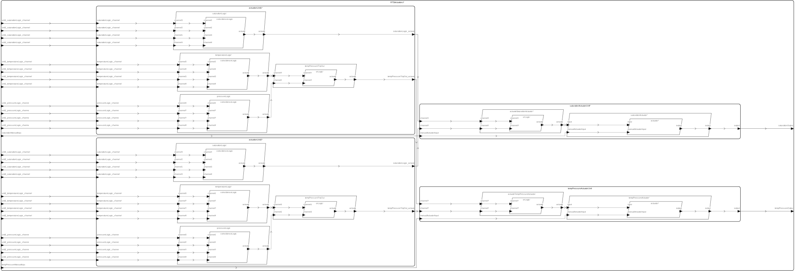

# <!---title_start-->RTS<!---title_end-->
<!---description_start-->
<!---description_end-->
## <!--arch-section-title_start-->AADL Architecture<!--arch-section-title_end-->
<!--arch-section-description_start-->
<!--arch-section-description_end-->
<!--arch-section-aadl-arch-diagram_start-->

<!--arch-section-aadl-arch-diagram_end-->
<!--arch-section-aadl-arch-component-info-RTS_i_Instance_start-->
|System: [RTS::RTS.i](aadl/packages/RTS.aadl#L35) |
|:--|
<!--arch-section-aadl-arch-component-info-RTS_i_Instance_end-->
<!--arch-section-aadl-arch-component-info-actuator_start-->
|Thread: [actuator](aadl/packages/Actuation.aadl#L240) |
|:--|
|Type: [Actuation::Actuator](aadl/packages/Actuation.aadl#L187)<br>Implementation: [Actuation::Actuator.i](aadl/packages/Actuation.aadl#L216)|
|Periodic: 1000 ms|
|Domain: 14|

<!--arch-section-aadl-arch-component-info-actuator_end-->
<!--arch-section-aadl-arch-component-info-actuator_start-->
|Thread: [actuator](aadl/packages/Actuation.aadl#L240) |
|:--|
|Type: [Actuation::Actuator](aadl/packages/Actuation.aadl#L187)<br>Implementation: [Actuation::Actuator.i](aadl/packages/Actuation.aadl#L216)|
|Periodic: 1000 ms|
|Domain: 16|

<!--arch-section-aadl-arch-component-info-actuator_end-->
<!--arch-section-aadl-arch-component-info-coincidenceLogic_start-->
|Thread: [coincidenceLogic](aadl/packages/Actuation.aadl#L86) |
|:--|
|Type: [Actuation::CoincidenceLogic](aadl/packages/Actuation.aadl#L22)<br>Implementation: [Actuation::CoincidenceLogic.i](aadl/packages/Actuation.aadl#L59)|
|Periodic: 1000 ms|
|Domain: 5|

<!--arch-section-aadl-arch-component-info-coincidenceLogic_end-->
<!--arch-section-aadl-arch-component-info-coincidenceLogic_start-->
|Thread: [coincidenceLogic](aadl/packages/Actuation.aadl#L86) |
|:--|
|Type: [Actuation::CoincidenceLogic](aadl/packages/Actuation.aadl#L22)<br>Implementation: [Actuation::CoincidenceLogic.i](aadl/packages/Actuation.aadl#L59)|
|Periodic: 1000 ms|
|Domain: 6|

<!--arch-section-aadl-arch-component-info-coincidenceLogic_end-->
<!--arch-section-aadl-arch-component-info-coincidenceLogic_start-->
|Thread: [coincidenceLogic](aadl/packages/Actuation.aadl#L86) |
|:--|
|Type: [Actuation::CoincidenceLogic](aadl/packages/Actuation.aadl#L22)<br>Implementation: [Actuation::CoincidenceLogic.i](aadl/packages/Actuation.aadl#L59)|
|Periodic: 1000 ms|
|Domain: 7|

<!--arch-section-aadl-arch-component-info-coincidenceLogic_end-->
<!--arch-section-aadl-arch-component-info-coincidenceLogic_start-->
|Thread: [coincidenceLogic](aadl/packages/Actuation.aadl#L86) |
|:--|
|Type: [Actuation::CoincidenceLogic](aadl/packages/Actuation.aadl#L22)<br>Implementation: [Actuation::CoincidenceLogic.i](aadl/packages/Actuation.aadl#L59)|
|Periodic: 1000 ms|
|Domain: 9|

<!--arch-section-aadl-arch-component-info-coincidenceLogic_end-->
<!--arch-section-aadl-arch-component-info-coincidenceLogic_start-->
|Thread: [coincidenceLogic](aadl/packages/Actuation.aadl#L86) |
|:--|
|Type: [Actuation::CoincidenceLogic](aadl/packages/Actuation.aadl#L22)<br>Implementation: [Actuation::CoincidenceLogic.i](aadl/packages/Actuation.aadl#L59)|
|Periodic: 1000 ms|
|Domain: 10|

<!--arch-section-aadl-arch-component-info-coincidenceLogic_end-->
<!--arch-section-aadl-arch-component-info-coincidenceLogic_start-->
|Thread: [coincidenceLogic](aadl/packages/Actuation.aadl#L86) |
|:--|
|Type: [Actuation::CoincidenceLogic](aadl/packages/Actuation.aadl#L22)<br>Implementation: [Actuation::CoincidenceLogic.i](aadl/packages/Actuation.aadl#L59)|
|Periodic: 1000 ms|
|Domain: 11|

<!--arch-section-aadl-arch-component-info-coincidenceLogic_end-->
<!--arch-section-aadl-arch-component-info-orLogic_start-->
|Thread: [orLogic](aadl/packages/Actuation.aadl#L152) |
|:--|
|Type: [Actuation::OrLogic](aadl/packages/Actuation.aadl#L101)<br>Implementation: [Actuation::OrLogic.i](aadl/packages/Actuation.aadl#L128)|
|Periodic: 1000 ms|
|Domain: 8|

<!--arch-section-aadl-arch-component-info-orLogic_end-->
<!--arch-section-aadl-arch-component-info-orLogic_start-->
|Thread: [orLogic](aadl/packages/Actuation.aadl#L152) |
|:--|
|Type: [Actuation::OrLogic](aadl/packages/Actuation.aadl#L101)<br>Implementation: [Actuation::OrLogic.i](aadl/packages/Actuation.aadl#L128)|
|Periodic: 1000 ms|
|Domain: 12|

<!--arch-section-aadl-arch-component-info-orLogic_end-->
<!--arch-section-aadl-arch-component-info-orLogic_start-->
|Thread: [orLogic](aadl/packages/Actuation.aadl#L152) |
|:--|
|Type: [Actuation::OrLogic](aadl/packages/Actuation.aadl#L101)<br>Implementation: [Actuation::OrLogic.i](aadl/packages/Actuation.aadl#L128)|
|Periodic: 1000 ms|
|Domain: 13|

<!--arch-section-aadl-arch-component-info-orLogic_end-->
<!--arch-section-aadl-arch-component-info-orLogic_start-->
|Thread: [orLogic](aadl/packages/Actuation.aadl#L152) |
|:--|
|Type: [Actuation::OrLogic](aadl/packages/Actuation.aadl#L101)<br>Implementation: [Actuation::OrLogic.i](aadl/packages/Actuation.aadl#L128)|
|Periodic: 1000 ms|
|Domain: 15|

<!--arch-section-aadl-arch-component-info-orLogic_end-->
<!--arch-section-aadl-arch-component-info-actuatorsMockThread_start-->
|Thread: [actuatorsMockThread](aadl/packages/Actuators.aadl#L48) |
|:--|
|Type: [Actuators::ActuatorsMockThread](aadl/packages/Actuators.aadl#L16)<br>Implementation: [Actuators::ActuatorsMockThread.i](aadl/packages/Actuators.aadl#L23)|
|Periodic: 1000 ms|
|Domain: 4|

<!--arch-section-aadl-arch-component-info-actuatorsMockThread_end-->
<!--arch-section-aadl-arch-component-info-eventControlMockThread_start-->
|Thread: [eventControlMockThread](aadl/packages/EventControl.aadl#L69) |
|:--|
|Type: [EventControl::EventControlMockThread](aadl/packages/EventControl.aadl#L16)<br>Implementation: [EventControl::EventControlMockThread.i](aadl/packages/EventControl.aadl#L37)|
|Periodic: 1000 ms|
|Domain: 3|

<!--arch-section-aadl-arch-component-info-eventControlMockThread_end-->
<!--arch-section-aadl-arch-component-info-instrumentationMockThread_start-->
|Thread: [instrumentationMockThread](aadl/packages/Instrumentation.aadl#L195) |
|:--|
|Type: [Instrumentation::InstrumentationMockThread](aadl/packages/Instrumentation.aadl#L14)<br>Implementation: [Instrumentation::InstrumentationMockThread.i](aadl/packages/Instrumentation.aadl#L97)|
|Periodic: 1000 ms|
|Domain: 2|

<!--arch-section-aadl-arch-component-info-instrumentationMockThread_end-->

## <!---title_start-->Metrics<!---title_end-->
<!---description_start-->
<!---description_end-->
### <!---title_start-->AADL Metrics<!---title_end-->
<!---description_start-->
<!---description_end-->
<!---_start-->
| | |
|:--|:--|
|Threads|15|
|Ports|76|
|Connections|38|
<!---_end-->

### <!---title_start-->JVM Metrics<!---title_end-->
<!---description_start-->
<!---description_end-->
<!---RTS_code_metrics_start-->
Directories Scanned Using [https://github.com/AlDanial/cloc](https://github.com/AlDanial/cloc) v1.94:
- [hamr/slang/src/main](hamr/slang/src/main)

<u><b>Total LOC</b></u>

Total number of HAMR-generated and developer-written lines of code
Language|files|blank|comment|code
:-------|-------:|-------:|-------:|-------:
Scala|147|5720|2738|26542
--------|--------|--------|--------|--------
SUM:|147|5720|2738|26542

<u><b>User LOC</b></u>

The number of lines of code written by the developer.
"Log" are lines of code used for logging that
likely would be excluded in a release build
 |Type|code |
 |:--|--:|
 |Behavior|156|
 |Log|6|
 |--------|--------|
 |SUM:|162|
<!---RTS_code_metrics_end-->

## <!--system-testing-setup-title_start-->System Testing<!--system-testing-setup-title_end-->
<!--system-testing-setup-description_start-->
<!--system-testing-setup-description_end-->
### <!--configurations-title_start-->Test Run Configurations<!--configurations-title_end-->
<!--configurations-description_start-->
<!--configurations-description_end-->
#### <!--Actuation_Subsystem_DSC_Test_Harness_configurations-title_start-->Configurations for Actuation_Subsystem_DSC_Test_Harness<!--Actuation_Subsystem_DSC_Test_Harness_configurations-title_end-->
<!--Actuation_Subsystem_DSC_Test_Harness_configurations-description_start-->
<!--Actuation_Subsystem_DSC_Test_Harness_configurations-description_end-->
<!--Actuation_Subsystem_DSC_Test_Harness_configurations-Actuation_Subsystem_DSC_Test_Harness_TempPress_Manual_Trip_configuration_content_start-->
<table>
<tr><th colspan=2 align="left"><a href="hamr/slang/src/test/system/RTS/system_tests/rts1/Actuation_Subsystem_Test_wSlangCheck.scala#L64">TempPress_Manual_Trip</a></th>
</tr><tr>
<td>Description:</td><td>TempPress Manual Trip</td>
</tr><tr>
<td>Script Schema:</td><td><a href="hamr/slang/src/test/system/RTS/system_tests/rts1/Actuation_Subsystem_Test_wSlangCheck.scala#L264">Actuation_Subsystem_1HP_script_schema</a></td>
</tr><tr>
<td>Property:</td><td><a href="hamr/slang/src/test/system/RTS/system_tests/rts1/Actuation_Subsystem_Test_wSlangCheck.scala#L391">sysProp_TempPressManualTrip</a></td>
</tr><tr>
<td>Randomization Profile:</td><td>getDefaultProfile, _i.e. uses default configurations as provided by SlangCheck_</td>
</tr><tr>
<td>Random Vector Filter:</td><td><a href="hamr/slang/src/test/system/RTS/system_tests/rts1/Actuation_Subsystem_Test_wSlangCheck.scala#L207)">examplePreStateContainerFilter</a></td>
</tr>
</table>

<!--Actuation_Subsystem_DSC_Test_Harness_configurations-Actuation_Subsystem_DSC_Test_Harness_TempPress_Manual_Trip_configuration_content_end-->
<!--Actuation_Subsystem_DSC_Test_Harness_configurations-Actuation_Subsystem_DSC_Test_Harness_Saturation_Manual_Trip_configuration_content_start-->
<table>
<tr><th colspan=2 align="left"><a href="hamr/slang/src/test/system/RTS/system_tests/rts1/Actuation_Subsystem_Test_wSlangCheck.scala#L71">Saturation_Manual_Trip</a></th>
</tr><tr>
<td>Description:</td><td>Saturation Manual Trip</td>
</tr><tr>
<td>Script Schema:</td><td><a href="hamr/slang/src/test/system/RTS/system_tests/rts1/Actuation_Subsystem_Test_wSlangCheck.scala#L264">Actuation_Subsystem_1HP_script_schema</a></td>
</tr><tr>
<td>Property:</td><td><a href="hamr/slang/src/test/system/RTS/system_tests/rts1/Actuation_Subsystem_Test_wSlangCheck.scala#L406">sysProp_SaturationManualTrip</a></td>
</tr><tr>
<td>Randomization Profile:</td><td>getDefaultProfile, _i.e. uses default configurations as provided by SlangCheck_</td>
</tr><tr>
<td>Random Vector Filter:</td><td><a href="hamr/slang/src/test/system/RTS/system_tests/rts1/Actuation_Subsystem_Test_wSlangCheck.scala#L207)">examplePreStateContainerFilter</a></td>
</tr>
</table>

<!--Actuation_Subsystem_DSC_Test_Harness_configurations-Actuation_Subsystem_DSC_Test_Harness_Saturation_Manual_Trip_configuration_content_end-->
<!--Actuation_Subsystem_DSC_Test_Harness_configurations-Actuation_Subsystem_DSC_Test_Harness_AU1TempTrip_configuration_content_start-->
<table>
<tr><th colspan=2 align="left"><a href="hamr/slang/src/test/system/RTS/system_tests/rts1/Actuation_Subsystem_Test_wSlangCheck.scala#L81">AU1TempTrip</a></th>
</tr><tr>
<td>Description:</td><td>AU1TempTrip</td>
</tr><tr>
<td>Script Schema:</td><td><a href="hamr/slang/src/test/system/RTS/system_tests/rts1/Actuation_Subsystem_Test_wSlangCheck.scala#L264">Actuation_Subsystem_1HP_script_schema</a></td>
</tr><tr>
<td>Property:</td><td><a href="hamr/slang/src/test/system/RTS/system_tests/rts1/Actuation_Subsystem_Test_wSlangCheck.scala#L424">sysProp_AU1TempTrip</a></td>
</tr><tr>
<td>Randomization Profile:</td><td>getDefaultProfile, _i.e. uses default configurations as provided by SlangCheck_</td>
</tr><tr>
<td>Random Vector Filter:</td><td><a href="hamr/slang/src/test/system/RTS/system_tests/rts1/Actuation_Subsystem_Test_wSlangCheck.scala#L207)">examplePreStateContainerFilter</a></td>
</tr>
</table>

<!--Actuation_Subsystem_DSC_Test_Harness_configurations-Actuation_Subsystem_DSC_Test_Harness_AU1TempTrip_configuration_content_end-->
<!--Actuation_Subsystem_DSC_Test_Harness_configurations-Actuation_Subsystem_DSC_Test_Harness_AU1PressTrip_configuration_content_start-->
<table>
<tr><th colspan=2 align="left"><a href="hamr/slang/src/test/system/RTS/system_tests/rts1/Actuation_Subsystem_Test_wSlangCheck.scala#L88">AU1PressTrip</a></th>
</tr><tr>
<td>Description:</td><td>AU1PressTrip</td>
</tr><tr>
<td>Script Schema:</td><td><a href="hamr/slang/src/test/system/RTS/system_tests/rts1/Actuation_Subsystem_Test_wSlangCheck.scala#L264">Actuation_Subsystem_1HP_script_schema</a></td>
</tr><tr>
<td>Property:</td><td><a href="hamr/slang/src/test/system/RTS/system_tests/rts1/Actuation_Subsystem_Test_wSlangCheck.scala#L435">sysProp_AU1PressTrip</a></td>
</tr><tr>
<td>Randomization Profile:</td><td>getDefaultProfile, _i.e. uses default configurations as provided by SlangCheck_</td>
</tr><tr>
<td>Random Vector Filter:</td><td><a href="hamr/slang/src/test/system/RTS/system_tests/rts1/Actuation_Subsystem_Test_wSlangCheck.scala#L207)">examplePreStateContainerFilter</a></td>
</tr>
</table>

<!--Actuation_Subsystem_DSC_Test_Harness_configurations-Actuation_Subsystem_DSC_Test_Harness_AU1PressTrip_configuration_content_end-->
<!--Actuation_Subsystem_DSC_Test_Harness_configurations-Actuation_Subsystem_DSC_Test_Harness_AU1SatTrip_configuration_content_start-->
<table>
<tr><th colspan=2 align="left"><a href="hamr/slang/src/test/system/RTS/system_tests/rts1/Actuation_Subsystem_Test_wSlangCheck.scala#L95">AU1SatTrip</a></th>
</tr><tr>
<td>Description:</td><td>AU1SatTrip</td>
</tr><tr>
<td>Script Schema:</td><td><a href="hamr/slang/src/test/system/RTS/system_tests/rts1/Actuation_Subsystem_Test_wSlangCheck.scala#L264">Actuation_Subsystem_1HP_script_schema</a></td>
</tr><tr>
<td>Property:</td><td><a href="hamr/slang/src/test/system/RTS/system_tests/rts1/Actuation_Subsystem_Test_wSlangCheck.scala#L446">sysProp_AU1SatTrip</a></td>
</tr><tr>
<td>Randomization Profile:</td><td>getDefaultProfile, _i.e. uses default configurations as provided by SlangCheck_</td>
</tr><tr>
<td>Random Vector Filter:</td><td><a href="hamr/slang/src/test/system/RTS/system_tests/rts1/Actuation_Subsystem_Test_wSlangCheck.scala#L207)">examplePreStateContainerFilter</a></td>
</tr>
</table>

<!--Actuation_Subsystem_DSC_Test_Harness_configurations-Actuation_Subsystem_DSC_Test_Harness_AU1SatTrip_configuration_content_end-->
<!--Actuation_Subsystem_DSC_Test_Harness_configurations-Actuation_Subsystem_DSC_Test_Harness_AU2TempTrip_configuration_content_start-->
<table>
<tr><th colspan=2 align="left"><a href="hamr/slang/src/test/system/RTS/system_tests/rts1/Actuation_Subsystem_Test_wSlangCheck.scala#L105">AU2TempTrip</a></th>
</tr><tr>
<td>Description:</td><td>AU2TempTrip</td>
</tr><tr>
<td>Script Schema:</td><td><a href="hamr/slang/src/test/system/RTS/system_tests/rts1/Actuation_Subsystem_Test_wSlangCheck.scala#L264">Actuation_Subsystem_1HP_script_schema</a></td>
</tr><tr>
<td>Property:</td><td><a href="hamr/slang/src/test/system/RTS/system_tests/rts1/Actuation_Subsystem_Test_wSlangCheck.scala#L460">sysProp_AU2TempTrip</a></td>
</tr><tr>
<td>Randomization Profile:</td><td>getDefaultProfile, _i.e. uses default configurations as provided by SlangCheck_</td>
</tr><tr>
<td>Random Vector Filter:</td><td><a href="hamr/slang/src/test/system/RTS/system_tests/rts1/Actuation_Subsystem_Test_wSlangCheck.scala#L207)">examplePreStateContainerFilter</a></td>
</tr>
</table>

<!--Actuation_Subsystem_DSC_Test_Harness_configurations-Actuation_Subsystem_DSC_Test_Harness_AU2TempTrip_configuration_content_end-->
<!--Actuation_Subsystem_DSC_Test_Harness_configurations-Actuation_Subsystem_DSC_Test_Harness_AU2PressTrip_configuration_content_start-->
<table>
<tr><th colspan=2 align="left"><a href="hamr/slang/src/test/system/RTS/system_tests/rts1/Actuation_Subsystem_Test_wSlangCheck.scala#L112">AU2PressTrip</a></th>
</tr><tr>
<td>Description:</td><td>AU2PressTrip</td>
</tr><tr>
<td>Script Schema:</td><td><a href="hamr/slang/src/test/system/RTS/system_tests/rts1/Actuation_Subsystem_Test_wSlangCheck.scala#L264">Actuation_Subsystem_1HP_script_schema</a></td>
</tr><tr>
<td>Property:</td><td><a href="hamr/slang/src/test/system/RTS/system_tests/rts1/Actuation_Subsystem_Test_wSlangCheck.scala#L471">sysProp_AU2PressTrip</a></td>
</tr><tr>
<td>Randomization Profile:</td><td>getDefaultProfile, _i.e. uses default configurations as provided by SlangCheck_</td>
</tr><tr>
<td>Random Vector Filter:</td><td><a href="hamr/slang/src/test/system/RTS/system_tests/rts1/Actuation_Subsystem_Test_wSlangCheck.scala#L207)">examplePreStateContainerFilter</a></td>
</tr>
</table>

<!--Actuation_Subsystem_DSC_Test_Harness_configurations-Actuation_Subsystem_DSC_Test_Harness_AU2PressTrip_configuration_content_end-->
<!--Actuation_Subsystem_DSC_Test_Harness_configurations-Actuation_Subsystem_DSC_Test_Harness_AU2SatTrip_configuration_content_start-->
<table>
<tr><th colspan=2 align="left"><a href="hamr/slang/src/test/system/RTS/system_tests/rts1/Actuation_Subsystem_Test_wSlangCheck.scala#L119">AU2SatTrip</a></th>
</tr><tr>
<td>Description:</td><td>AU2SatTrip</td>
</tr><tr>
<td>Script Schema:</td><td><a href="hamr/slang/src/test/system/RTS/system_tests/rts1/Actuation_Subsystem_Test_wSlangCheck.scala#L264">Actuation_Subsystem_1HP_script_schema</a></td>
</tr><tr>
<td>Property:</td><td><a href="hamr/slang/src/test/system/RTS/system_tests/rts1/Actuation_Subsystem_Test_wSlangCheck.scala#L482">sysProp_AU2SatTrip</a></td>
</tr><tr>
<td>Randomization Profile:</td><td>getDefaultProfile, _i.e. uses default configurations as provided by SlangCheck_</td>
</tr><tr>
<td>Random Vector Filter:</td><td><a href="hamr/slang/src/test/system/RTS/system_tests/rts1/Actuation_Subsystem_Test_wSlangCheck.scala#L207)">examplePreStateContainerFilter</a></td>
</tr>
</table>

<!--Actuation_Subsystem_DSC_Test_Harness_configurations-Actuation_Subsystem_DSC_Test_Harness_AU2SatTrip_configuration_content_end-->
<!--Actuation_Subsystem_DSC_Test_Harness_configurations-Actuation_Subsystem_DSC_Test_Harness_TempPressTripCausality_configuration_content_start-->
<table>
<tr><th colspan=2 align="left"><a href="hamr/slang/src/test/system/RTS/system_tests/rts1/Actuation_Subsystem_Test_wSlangCheck.scala#L129">TempPressTripCausality</a></th>
</tr><tr>
<td>Description:</td><td>TempPressTripCausality</td>
</tr><tr>
<td>Script Schema:</td><td><a href="hamr/slang/src/test/system/RTS/system_tests/rts1/Actuation_Subsystem_Test_wSlangCheck.scala#L264">Actuation_Subsystem_1HP_script_schema</a></td>
</tr><tr>
<td>Property:</td><td><a href="hamr/slang/src/test/system/RTS/system_tests/rts1/Actuation_Subsystem_Test_wSlangCheck.scala#L510">sysProp_TempPressTripCausality</a></td>
</tr><tr>
<td>Randomization Profile:</td><td>getDefaultProfile, _i.e. uses default configurations as provided by SlangCheck_</td>
</tr><tr>
<td>Random Vector Filter:</td><td><a href="hamr/slang/src/test/system/RTS/system_tests/rts1/Actuation_Subsystem_Test_wSlangCheck.scala#L207)">examplePreStateContainerFilter</a></td>
</tr>
</table>

<!--Actuation_Subsystem_DSC_Test_Harness_configurations-Actuation_Subsystem_DSC_Test_Harness_TempPressTripCausality_configuration_content_end-->
<!--Actuation_Subsystem_DSC_Test_Harness_configurations-Actuation_Subsystem_DSC_Test_Harness_SatTripCausality_configuration_content_start-->
<table>
<tr><th colspan=2 align="left"><a href="hamr/slang/src/test/system/RTS/system_tests/rts1/Actuation_Subsystem_Test_wSlangCheck.scala#L136">SatTripCausality</a></th>
</tr><tr>
<td>Description:</td><td>SatTripCausality</td>
</tr><tr>
<td>Script Schema:</td><td><a href="hamr/slang/src/test/system/RTS/system_tests/rts1/Actuation_Subsystem_Test_wSlangCheck.scala#L264">Actuation_Subsystem_1HP_script_schema</a></td>
</tr><tr>
<td>Property:</td><td><a href="hamr/slang/src/test/system/RTS/system_tests/rts1/Actuation_Subsystem_Test_wSlangCheck.scala#L496">sysProp_SatTripCausality</a></td>
</tr><tr>
<td>Randomization Profile:</td><td>getDefaultProfile, _i.e. uses default configurations as provided by SlangCheck_</td>
</tr><tr>
<td>Random Vector Filter:</td><td><a href="hamr/slang/src/test/system/RTS/system_tests/rts1/Actuation_Subsystem_Test_wSlangCheck.scala#L207)">examplePreStateContainerFilter</a></td>
</tr>
</table>

<!--Actuation_Subsystem_DSC_Test_Harness_configurations-Actuation_Subsystem_DSC_Test_Harness_SatTripCausality_configuration_content_end-->
<!--Actuation_Subsystem_DSC_Test_Harness_configurations-Actuation_Subsystem_DSC_Test_Harness_ALU_Satisfies_Oracle_configuration_content_start-->
<table>
<tr><th colspan=2 align="left"><a href="hamr/slang/src/test/system/RTS/system_tests/rts1/Actuation_Subsystem_Test_wSlangCheck.scala#L146">ALU_Satisfies_Oracle</a></th>
</tr><tr>
<td>Description:</td><td>ALU Satisfies Oracle</td>
</tr><tr>
<td>Script Schema:</td><td><a href="hamr/slang/src/test/system/RTS/system_tests/rts1/Actuation_Subsystem_Test_wSlangCheck.scala#L264">Actuation_Subsystem_1HP_script_schema</a></td>
</tr><tr>
<td>Property:</td><td><a href="hamr/slang/src/test/system/RTS/system_tests/rts1/Actuation_Subsystem_Test_wSlangCheck.scala#L532">sysProp_ALU_Satisfies_Functional_Oracle</a></td>
</tr><tr>
<td>Randomization Profile:</td><td>getDefaultProfile, _i.e. uses default configurations as provided by SlangCheck_</td>
</tr><tr>
<td>Random Vector Filter:</td><td><a href="hamr/slang/src/test/system/RTS/system_tests/rts1/Actuation_Subsystem_Test_wSlangCheck.scala#L207)">examplePreStateContainerFilter</a></td>
</tr>
</table>

<!--Actuation_Subsystem_DSC_Test_Harness_configurations-Actuation_Subsystem_DSC_Test_Harness_ALU_Satisfies_Oracle_configuration_content_end-->

## <!--how-to-run-title_start-->How to Run<!--how-to-run-title_end-->
<!--how-to-run-description_start-->
System testing requires a Sireum distribution. Instructions on how to obtain a
distribution are available at [https://sireum.org/getting-started/](https://sireum.org/getting-started/).
The rest of this documentation assumes the ``SIREUM_HOME`` environmental variable has been set and that
sireum's bin directory has been added to your path (e.g. for Linux/MacOS ``export PATH=$SIREUM_HOME/bin:$PATH``
or Windows ``set PATH=%PATH%\bin;%PATH%``


<!--how-to-run-description_end-->
### <!--framework-generation-title_start-->Framework Generation<!--framework-generation-title_end-->
<!--framework-generation-description_start-->
1. Build the System Testing Artifact Generator following the instructions at
   [SystemTestArtifactGen/readme.md](../report/util/SystemTestArtifactGen/readme.md)
1. Run the generator by passing it the paths to one or more files that contain
   input/output container definitions

For example, running the generator on
[Containers.scala](hamr/slang/src/main/util/RTS/system_tests/rts1/Containers.scala)
will generate the following artifacts:

1. [Example_Actuation_Subsystem_Inputs_Container_Test_wSlangCheck.scala](hamr/slang/src/test/system/RTS/system_tests/rts1/Example_Actuation_Subsystem_Inputs_Container_Test_wSlangCheck.scala)

   System test suite containing an example test run configuration.  Developers can make a copy of this file and then define
   custom test run configurations where each configuration has the structure
   _(script schema, property, randomization profile, random vector filter)_

1. [Example_Actuation_Subsystem_Inputs_Container_DSC_Test_Harness.scala](hamr/slang/src/test/system/RTS/system_tests/rts1/Example_Actuation_Subsystem_Inputs_Container_DSC_Test_Harness.scala)

      Example showing how a system test suite can be adapted for use with Distributed SlangCheck (DSC). It overrides/implements
   two DCS methods, ``next`` and ``test``.  The next method is called during DSC's test vector generation phase. The generated
   vectors are subsequently passed to the test method during DSC's testing phase. Both methods use the environment variable
   ``DSC_TEST_FAMILY_NAME`` to determine which test run configuration should be used.


<!--framework-generation-description_end-->

### <!--manual-testing-title_start-->Manual System Testing<!--manual-testing-title_end-->
<!--manual-testing-description_start-->
The example system test suites described previously were used to write
system tests for the Actuator subsystem as follows:
<!--manual-testing-description_end-->
<!--manual-testing-Actuator subsystem_block_start-->
__Actuator subsystem__

  System Test Suite Class: [Actuation_Subsystem_Test_wSlangCheck.scala](hamr/slang/src/test/system/RTS/system_tests/rts1/Actuation_Subsystem_Test_wSlangCheck.scala)

  Test run configurations are specified via entries in the [testMatrix](hamr/slang/src/test/system/RTS/system_tests/rts1/Actuation_Subsystem_Test_wSlangCheck.scala#L60). For example,
  the [TempPress_Manual_Trip](hamr/slang/src/test/system/RTS/system_tests/rts1/Actuation_Subsystem_Test_wSlangCheck.scala#L64) configuration uses the following:

  | | |
  |:--|--|
  | Script Schema: | [Actuation_Subsystem_1HP_script_schema](hamr/slang/src/test/system/RTS/system_tests/rts1/Actuation_Subsystem_Test_wSlangCheck.scala#L264) |
  | Property: | [sysProp_SaturationManualTrip](hamr/slang/src/test/system/RTS/system_tests/rts1/Actuation_Subsystem_Test_wSlangCheck.scala#L406) |
  | Randomization Profile: | getDefaultProfile, _i.e. uses default configurations as provided by SlangCheck_ |
  | Random Vector Filter: | [examplePreStateContainerFilter](hamr/slang/src/test/system/RTS/system_tests/rts1/Actuation_Subsystem_Test_wSlangCheck.scala#L207) |

  How to run:

  ```
  cd hamr-system-testing-case-studies

  sireum proyek test --suffixes Actuation_Subsystem_Test_wSlangCheck rts/hamr/slang
  ```


<!--manual-testing-Actuator subsystem_block_end-->

### <!--dsc-testing-title_start-->Distributed SlangCheck System Testing<!--dsc-testing-title_end-->
<!--dsc-testing-description_start-->
Background:

System testing as put forth in this paper uses SlangCheck to generate input/injection test vectors.
SlangCheck is Sireum's randomized
test generator framework similar to ScalaCheck and Haskell's QuickCheck.
Distributed SlangCheck (DSC) adds a framework that allows test vector
generation to be run via a server cluster up to a user specified timeout. Increasing
the timeout allows more vectors to be produced which may lead to increased code
coverage during testing. DSC passes the vectors to user defined unit tests
and serializes the
passing and failing vectors to seperate files so that they can be replayed if needed.
DSC uses JaCoCo to produce code coverage information.

Approach:

The TempPress_Manual_Trip configuration of RTS's
Actuation_Subsystem_Test_wSlangCheck test suite will be used to
illustrate how system testing can employ DSC.  The actual results reported in the next
section simply automated the following steps such that each configuration was run with timeouts
of 1, 5, and 10 seconds using a Jenkins cluster.

Create a jar file for this project that includes the sources and tests suites

```
cd hamr-system-testing-case-studies

sireum proyek assemble --include-sources --include-tests rts/hamr/slang
```

Set the environment variable ``DSC_TEST_FAMILY_NAME`` to indicate which configuration
should be used

```
export DSC_TEST_FAMILY_NAME=TempPress_Manual_Trip
```

The following will repeatedly call Actuation_Subsystem_DSC_Test_Harness's next method for 1 second to generate test vectors
and store them in a local file (DSC can be
configured to scp the results to a remote server where they can be combined with vectors
generated from other 'generating' servers)
```
sireum tools slangcheck runner\
  -t 1\
  -o $(pwd)/rts-dsc.jsons\
  -c rts/hamr/slang/out/slang/assemble/slang.jar\
  RTS.system_tests.rts1.Actuation_Subsystem_DSC_Test_Harness
```

DSC is designed to only report passing and failing test vectors.  The generated DSC
test harness test methods extend this by invoking the configuration's random vector filter and
writing out unsat vectors to a file specified via the ``DSC_SAVE_LOC`` environment variable.
```
export DSC_SAVE_LOC=$(pwd)/rts-dsc-output.unsat
touch $DSC_SAVE_LOC
```

The following will pass each test vector to the Actuation_Subsystem_DSC_Test_Harness's test method,
record the passing/failing/unsat test vectors in separate files and generate an HTML
report that combines the coverage information across all the runs.
```
sireum tools slangcheck tester\
  -i $(pwd)/rts-dsc.jsons.dsc.7z\
  -o $(pwd)/rts-dsc-output\
  --coverage $(pwd)/rts-jacoco\
  -c rts/hamr/slang/out/slang/assemble/slang.jar\
  --sourcepath rts/hamr/slang/out/slang/assemble/slang.jar\
  RTS.system_tests.rts1.Actuation_Subsystem_DSC_Test_Harness
```

Results:

The full experimental results for the RTS are available at:<br>
[https://people.cs.ksu.edu/~santos_jenkins/pub/hamr-system-testing-case-studies/RTS](https://people.cs.ksu.edu/~santos_jenkins/pub/hamr-system-testing-case-studies/RTS/report.html)

<br><br>
The following table explains the report directory structure,
starting with the results from a specific run of DSC and then walking
up the report directory hierarchy.

||
|:--|
|[RTS/Actuation_Subsystem_DSC_Test_Harness/TempPress_Manual_Trip/1](https://people.cs.ksu.edu/~santos_jenkins/pub/hamr-system-testing-case-studies/RTS/Actuation_Subsystem_DSC_Test_Harness/TempPress_Manual_Trip/1/report.html)<br><br>The combined coverage information along with the number of passing/failing/unsat test vectors for the TempPress_Manual_Trip configuration with a 1 second timeout<br><br>__NOTE__ this is what DSC was actually run on.  The following rows are simply aggregate information |
|[RTS/Actuation_Subsystem_DSC_Test_Harness/TempPress_Manual_Trip](https://people.cs.ksu.edu/~santos_jenkins/pub/hamr-system-testing-case-studies/RTS/Actuation_Subsystem_DSC_Test_Harness/TempPress_Manual_Trip/report.html)<br><br>The combined coverage information along with the number of passing/failing/unsat test vectors for the MA__Failing__CT____Alarm_On configuration using timeouts of 1, 5, and 10 seconds |
|[RTS/Actuation_Subsystem_DSC_Test_Harness](https://people.cs.ksu.edu/~santos_jenkins/pub/hamr-system-testing-case-studies/RTS/Actuation_Subsystem_DSC_Test_Harness/report.html)<br><br>The combined coverage information along with the number of passing/failing/unsat test vectors for running all the configurations through Actuation_Subsystem_DSC_Test_Harness using timeouts of 1, 5, and 10 seconds |
|[RTS](https://people.cs.ksu.edu/~santos_jenkins/pub/hamr-system-testing-case-studies/RTS/report.html)<br><br>The combined coverage information along with the number of passing/failing/unsat test vectors for each of the RTS's subsystems under testing using timeouts of 1, 5, and 10 seconds |

<!--dsc-testing-description_end-->
